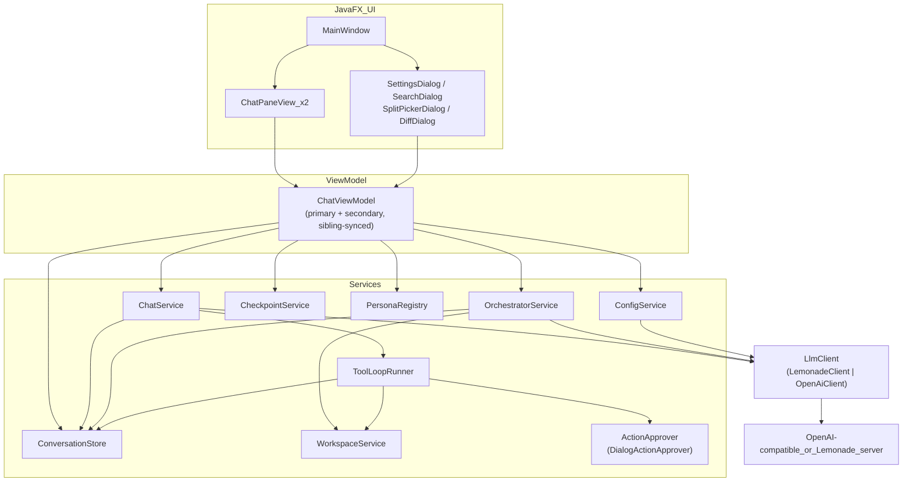

# MultiAgent Desktop (Java) — Architecture & User Guide

MultiAgent Desktop (Java) is a JavaFX port of [`desktop/`](../desktop) (the Electron/React client) that started as a **separate, parallel client** in the same repo and is now **the actively developed one** — `desktop/` is deprecated, kept for reference only. It connects to **Lemonade**, any other **OpenAI-compatible server** (NoLlama, LM Studio, vLLM, real OpenAI, ...), or a native **Ollama** server — save multiple named connections in Settings and switch between them, or pin different conversations to different servers. It supports switchable agent personas (pinned per conversation), folder-bound workspace chats with read/write/rename/git plus a sandboxed `run_command` (build/test) tool, all gated behind an approval dialog, project grouping over folders, text-file attachments, message edit/regenerate, a token-usage estimate, orchestrator sessions that route work across specialists, and a side-by-side split view for comparing two conversations from the same folder. Messages persist to SQLite, conversations can be searched and exported, and AI file writes can be reviewed as a diff and reverted.

See [Differences from the Electron client](#10-differences-from-the-electron-client) for what this port intentionally does or doesn't carry over, and what it's since gained that never made it back into `desktop/`.

---

## Table of contents

1. [Overview](#1-overview)
2. [Architecture](#2-architecture)
3. [Project structure](#3-project-structure)
4. [Data & persistence](#4-data--persistence)
5. [Service surface](#5-service-surface)
6. [Features in detail](#6-features-in-detail)
7. [How to use](#7-how-to-use)
8. [Develop & build](#8-develop--build)
9. [Troubleshooting](#9-troubleshooting)
10. [Differences from the Electron client](#10-differences-from-the-electron-client)
11. [Ideas not yet implemented](#11-ideas-not-yet-implemented)

---

## 1. Overview

| Concern      | Choice                                                                                                       |
| ------------ | -------------------------------------------------------------------------------------------------------------- |
| Shell        | JavaFX desktop app, single JVM process — no main/renderer split, no IPC                                          |
| UI           | JavaFX 21 controls, built in plain Java (no FXML) under `ui/` — `MainWindow` + `ui/components/*`                |
| State        | `ui/viewmodel/ChatViewModel` — an MVVM view model exposing JavaFX `ObservableList`/`Property` fields, two instances share one backend for split view (mirrors `chatStore.ts`'s factory pattern) |
| LLM          | `llm/` — `OpenAiClient` (generic OpenAI-compatible, via `java.net.http.HttpClient`), `LemonadeClient` (extends it with Lemonade's load-status extension), picked by `AppSettings.providerType` |
| Settings     | Jackson-backed JSON file → `%APPDATA%/MultiAgentJava/config.json`                                                |
| Chats        | SQLite via **sqlite-jdbc** (JDBC, no WASM) → `%APPDATA%/MultiAgentJava/chats.db`                                  |
| Build/run    | Maven — `mvn javafx:run` for the dev loop; `mvn package` + `jpackage` for a per-OS installer, driven by CI (see [§8](#8-develop--build)) |

**Security rule, ported as-is:** all file-system access is still funneled through `WorkspaceService`'s sandboxed `resolveSafe()` (relative-path check plus a `Path.toRealPath()` symlink check), exactly like `shared/workspace/workspaceService.ts`. There's no separate process boundary to enforce it — this is a single JVM — but the workspace tools never touch a path outside the bound folder regardless of what a model asks for.

### Providers

`llm.LlmClient` is the interface (`checkHealth`, `listModels`, `listLoadedModelNames`, `supportsLoadStatus`, `ensureModelLoaded`, `streamChat`, `completeChat`, `supportsImageGeneration`) all three implementations satisfy:

- **`OpenAiClient`** (`llm/OpenAiClient.java`) — any generic OpenAI-compatible server. Uses the JDK's own `HttpClient` for `/chat/completions` (SSE streaming via `streaming/SseLineReader.java`, and non-streaming `completeChat` with a `tools` payload for the agent loop) and `/models`. No load-status signal on the standard `/v1` surface, so `listLoadedModelNames()`/`supportsLoadStatus()` are honest about that (empty list, `false`) and `ensureModelLoaded` is a no-op.
- **`LemonadeClient`** (`llm/LemonadeClient.java`) — `extends OpenAiClient`, adding Lemonade's `/health` (parses `all_models_loaded`) and `POST /load` + poll-until-ready (1.5s interval, 10min timeout) on top of the inherited chat behavior.
- **`OllamaClient`** (`llm/OllamaClient.java`) — native Ollama protocol, deliberately standalone rather than extending `OpenAiClient` since the wire format differs at almost every call: `POST /api/chat` (NDJSON streaming via `streaming/NdjsonLineReader.java`, not SSE), `GET /api/tags` for model listing, `GET /api/ps` for currently-loaded models (best-effort — degrades to `supportsLoadStatus() == false` if the server doesn't implement it), `POST /api/generate` with no prompt to trigger on-demand loading. Ollama assigns no id to tool calls and sends `arguments` as a JSON object rather than a string, so `completeChat`/`toOllamaMessages` synthesize an id and re-serialize arguments to match the shape every other provider produces. **Has no image-generation endpoint** — `supportsImageGeneration()` returns `false`.

`LlmClientFactory.create(providerType, settings)` picks the implementation, mirroring `shared/llm/createLlmClient.ts`.

---

## 2. Architecture



### Layer roles

- **UI (`ui/`, `ui/components/`)** — plain-Java JavaFX construction (no FXML), reacting to `ChatViewModel`'s `ObservableList`/`Property` fields. `MainWindow` owns the sidebar (folder-grouped `TreeView`, bound to the primary view model only) and the global topbar (Search/Refresh/Settings/Close-split); `ChatPaneView` is the per-pane topbar+thread+composer, instantiated twice for split view.
- **ViewModel (`ui/viewmodel/ChatViewModel`)** — the MVVM layer and the seam that gives each conversation its own isolated state. Holds a `ConversationSession` per conversation id (streaming buffer, workspace-op list, error, orchestrator status) so switching the active conversation never carries over another one's in-flight state, and a `resolveModelFor`/`resolveServerFor`/`resolvePersonaFor` trio that reads each of those off the `Conversation` row itself rather than a single shared field — this is what makes model/server/persona genuinely per-chat (see [§10](#10-differences-from-the-electron-client) for why persona differs from the Electron app here). Background work runs on a per-instance executor and marshals results back via `Platform.runLater`.
- **Services (`service/`)** — `ChatService` (plain chat + delegates to `ToolLoopRunner` when a workspace is bound), `OrchestratorService` (plan → specialists → synthesize; each specialist runs through the shared `ToolLoopRunner` — full read+write tools, approval-gated — when a workspace is bound), `ToolLoopRunner` (the shared native-tool-calling/XML-tag/JSON-tool-call agent loop — file tools + `GitService` + `RunCommandService`, factored out so `ChatService` and `OrchestratorService` don't duplicate it), `CheckpointService` (diff/revert), `PersonaRegistry`, `ConfigService`, `DebugLog` (opt-in raw HTTP capture — see [§6](#raw-api-debug-log)).
- **Persistence (`persistence/`)** — `ConversationStore` over `sqlite-jdbc`, `Migrations` (additive, `PRAGMA table_info`-guarded).
- **Workspace (`workspace/`)** — `WorkspaceService` (sandboxed list/read/write/delete/rename + tree-building), `ActionTagParser` and `JsonToolCallParser` (two independent fallbacks for models without reliable native tool-calling — see [§6](#6-features-in-detail)).
- **Action approval (`action/`, `ui/components/DialogActionApprover`)** — a small, deliberately generic interface (`ActionApprover.approve(PendingAction)`) sitting between the tool loop and execution, so any future mutating action type (not just files) can gate on the same "describe → ask → execute" pipeline without new plumbing.

### Chat request path (text)

1. User sends a message in the composer.
2. `ChatPaneView` → `ChatViewModel.sendMessage(text)`.
3. `ChatViewModel` resolves that conversation's own server/model/persona, then calls `ChatService.send(...)` on a background thread.
4. `ChatService` loads history, builds the system prompt (persona + workspace tree/instructions if a folder is bound), and either streams tokens directly from the `LlmClient` (plain chat) or hands off to `ToolLoopRunner` (workspace-bound chat), which runs up to 8 rounds of tool-call → execute → feed-result-back before returning one final answer.
5. Callbacks (`onToken`/`onDone`/`onError`/`onWorkspaceOp`) land on `ChatViewModel`'s `Listener`, which updates that conversation's `ConversationSession` and, via `Platform.runLater`, the observable properties the UI is bound to.

For `kind == ORCHESTRATOR`, `ChatViewModel` calls `OrchestratorService.send(...)` instead, which drives its own plan/specialist/synthesize sequence and reports progress through `onStep`/`onMessagesUpdated`.

**Provider errors mid-stream.** llama.cpp / Lemonade answer a streaming request with HTTP 200 and then report failures (most commonly `request … exceeds the available context size`) as an `{"error": …}` SSE frame rather than an HTTP status. `OpenAiClient.streamChat` inspects every frame for that `error` object and throws it as a `ProviderException` (classified to `CONTEXT_EXCEEDED` etc.), instead of the frame being dropped and the turn ending with a silent empty reply. The non-streaming path (`sendJson`) does the same for a 2xx body that is actually an error object.

### Tool-calling agent loop (`ToolLoopRunner`)

Each round: call `completeChat(messages, model, tools)`, then look for an action to execute, in order:

1. **Native tool calls** — the server's own `tool_calls` response field (works when the server/model combination actually supports OpenAI-style function calling and returns it correctly).
2. **XML action tags** (`ActionTagParser`) — `<write_file path="...">content</write_file>`-style tags, for models instructed via the system prompt to use them instead of native calling.
3. **JSON tool-call text** (`JsonToolCallParser`) — some tool-tuned models (Qwen2.5-Coder via Lemonade/llama.cpp is the concrete case this was built for) print the `{"name": "write_file", "arguments": {...}}` shape they were fine-tuned to emit as plain text — bare, in a ```json fence, or inside `<tool_call>` tags — instead of either of the above. This fallback recognizes only the app's known tool names, so it can't misfire on unrelated JSON in an answer.

Whichever path matches, mutating tools (`write_file`/`delete_file`/`rename_file`) are gated through `ActionApprover.approve(PendingAction)` before they touch disk — a declined action returns `"Error: User declined this action."` as the tool result (so the model can adapt) without executing or capturing a checkpoint. Read-only tools (`list_dir`/`read_file`) never prompt. If no approver is installed, calls auto-approve — a testing convenience only; `App.java` always installs a real `DialogActionApprover` for the running app.

---

## 3. Project structure

`desktop-java/` is a Maven module at the repo root, alongside `desktop/` and `vscode-extension/`. It reuses `personas/*.json` from the repo root (copied into `target/classes/personas` at build time) but does **not** read `shared/` — that's TypeScript; the equivalent logic (`LlmClient`, `WorkspaceService`, action-tag parsing) is reimplemented in Java under this module.

```
MultiAgent/
  desktop-java/
    pom.xml
    src/main/java/com/multiagent/desktop/
      App.java                        # JavaFX Application entry point
      action/
        PendingAction.java            # record: category, summary, detail (preview text)
        ActionApprover.java           # approve(PendingAction): boolean
      llm/
        LlmClient.java  ProviderException.java (+ ErrorCode)  ProviderSettings.java
        ChatCompletionResult.java  ChatRequestMessage.java  ToolCall.java  ToolDefinition.java
        OpenAiClient.java  LemonadeClient.java  LlmClientFactory.java
        streaming/SseLineReader.java
      workspace/
        WorkspaceService.java         # sandboxed list/read/write/delete/rename + tree
        GitService.java               # fixed-allowlist git_* subcommands, cwd-pinned
        RunCommandService.java        # run_command: single-process build/test, argv-only, cwd-locked, approval-gated
        ActionTagParser.java          # XML action-tag fallback
        JsonToolCallParser.java       # JSON-shaped tool-call text fallback
        WorkspaceException.java  RunCommandException.java
      persistence/
        ConversationStore.java  Migrations.java
      service/
        ChatService.java              # plain chat + workspace delegation
        ToolLoopRunner.java           # shared tool-calling agent loop
        OrchestratorService.java      # plan -> specialists (full tools when a folder is bound) -> synthesize
        CheckpointService.java        # diff/revert
        PersonaRegistry.java  ConfigService.java  ExportFormat.java  PlanParser.java
        DebugLog.java                 # opt-in raw LLM HTTP capture (in-memory ring + api-debug.log)
        SpecialistModels.java         # (de)serialize Conversation.specialistModels JSON
        TokenEstimate.java  VisionResponses.java
      model/
        Persona.java  Conversation.java  ConversationKind.java  ChatMessage.java  MessageRole.java
        ServerProfile.java  ProviderType.java  AppSettings.java  ThemeMode.java
        ModelInfo.java  HealthStatus.java  FolderEntry.java  SearchResult.java
        FileCheckpoint.java  CheckpointDiff.java  ImageAttachment.java
      ui/
        MainWindow.java                # sidebar + global topbar + split layout + theming
        viewmodel/ChatViewModel.java   # ConversationSession-per-chat isolation, sibling sync
        viewmodel/WorkspaceOpEntry.java
        components/
          ChatPaneView.java            # per-pane topbar + thread + composer (x2 for split view)
          ChatThread.java  Composer.java
          SettingsDialog.java  ServerEditDialog.java  PersonaEditDialog.java
          SearchDialog.java  SplitPickerDialog.java  DiffDialog.java
          DialogActionApprover.java    # the "ask before writing/deleting/renaming" dialog
          DebugLogWindow.java          # non-modal viewer for DebugLog (list + raw request/response)
          SpecialistModelsDialog.java  # orchestrator: model per specialist for this chat
    src/main/resources/com/multiagent/desktop/ui/
      styles.css  theme-dark.css  theme-terminal.css
    src/test/java/com/multiagent/desktop/...   # JUnit 5, one test class per main class above
  desktop/            # Electron client (untouched by this module)
  vscode-extension/   # VS Code client (untouched by this module)
  shared/             # TS-only; read as reference during the port, not depended on
  personas/           # General, Researcher, Coder, Critic, Orchestrator - shared source of truth
                      # (user-defined personas layer on top at %APPDATA%/MultiAgentJava/personas/)
```

---

## 4. Data & persistence

### Settings (Jackson JSON file)

| Field            | Default                         | Purpose                                                                       |
| ---------------- | -------------------------------- | ------------------------------------------------------------------------------ |
| `providerType`    | `lemonade`                       | `lemonade` or `openai` (`ollama` accepted in config but rejected at connect time) |
| `baseUrl`         | `http://localhost:13305/api/v1`  | Active connection's server API base                                             |
| `apiKey`          | `local-llm`                      | Required by the OpenAI client shape; unused by Lemonade                         |
| `model`           | `""`                              | Fallback chat/orchestrator model for conversations without their own            |
| `maxHistory`      | `40`                              | Max messages sent as history                                                    |
| `theme`           | `light`                           | `light` \| `dark` \| `terminal`                                                 |
| `servers`         | `[]`                              | Saved `ServerProfile` list (id, name, providerType, baseUrl, apiKey, maxHistory, visionModel, contextTokens) |
| `activeServerId`  | `null`                            | Id of the `servers` entry currently copied into the active-connection fields    |
| `debugLogging`    | `false`                           | "Debug: log raw API traffic" — feeds `DebugLog` (in-app panel + `api-debug.log`), see [§6](#raw-api-debug-log) |

`ConfigService.ensureDefaultServer()` seeds one profile from the active-connection fields on first run if `servers` is empty, exactly mirroring `electron/config.ts`'s `ensureDefaultServer()`.

Path: `%APPDATA%/MultiAgentJava/config.json` (its own folder — deliberately separate from the Electron app's `%APPDATA%/MultiAgent/`, since the two clients' config shapes aren't guaranteed to round-trip through each other, even though the field names read the same).

### Conversations / messages (SQLite via sqlite-jdbc)

- `conversations(id, title, createdAt, updatedAt, workspacePath, kind, model, serverId, personaId, visionModel, specialistModels, orchestratorApply)` — `personaId`, `visionModel` and `specialistModels` (orchestrator per-specialist model overrides, JSON) are Java-client-only additions (see [§10](#10-differences-from-the-electron-client)); `orchestratorApply` is a legacy no-op column (see [§6](#orchestrator-sessions)); everything else matches the Electron schema field-for-field.
- `messages(id, conversationId, role, content, personaId, createdAt)`, indexed on `(conversationId, createdAt)`.
- `folders(path, addedAt)`.
- `file_checkpoints(id, conversationId, relativePath, previousContent, previousExisted, createdAt)` — one row per successful `write_file`/`delete_file`, capturing pre-op content (`previousContent: null` + `previousExisted: false` means the op created the file).

Every `ALTER TABLE` in `Migrations.run()` is guarded by a `PRAGMA table_info` check first, so re-running it against an existing db is always a no-op if the column is already there.

Path: `%APPDATA%/MultiAgentJava/chats.db`

---

## 5. Service surface

There's no IPC layer in this client — `ChatViewModel` calls services directly, in-process. The equivalent "contract" is:

| Entry point | Shape | Purpose |
| --- | --- | --- |
| `ChatService.send(client, conversation, content, persona, model, maxHistory, listener)` | async, callback-based | Runs one chat turn (plain or workspace tool loop) on a background thread |
| `ChatService.Listener` | interface | `onToken` / `onDone` / `onError` / `onWorkspaceOp` / `onStep` / `onMessagesUpdated` — the callback contract both `ChatService` and `OrchestratorService` report through |
| `OrchestratorService.send(...)` | async, callback-based | Same `Listener` contract, drives the plan → specialists → synthesize sequence; specialists get the full write-capable tool loop when a workspace is bound |
| `ChatService.cancel(conversationId)` / `OrchestratorService.cancel(conversationId)` | sync | Cancels that conversation's in-flight `CancellationToken` — per-conversation, not global |
| `ChatService.setActionApprover(approver)` | sync | Installs the write/delete/rename confirmation gate |
| `CheckpointService.diff(checkpointId)` / `.revert(checkpointId)` | sync | Backing calls for the chat thread's View diff / Revert buttons |
| `ConversationStore.*` | sync, JDBC | CRUD + `search()` + folder/checkpoint tables — called directly by `ChatViewModel`, no separate repository-of-repositories layer |
| `DebugLog.setEnabled` / `.entries()` / `.clear()` / `.begin(...)` | sync, static | Opt-in raw HTTP capture: `App`/`SettingsDialog` toggle it, `OpenAiClient`/`LemonadeClient` feed it, `DebugLogWindow` reads it |

`ChatViewModel` exposes the UI-facing half of this as JavaFX bindable state (`conversations()`, `messages()`, `activeConversationProperty()`, `streamingProperty()`, `errorMessageProperty()`, etc.) plus action methods (`sendMessage`, `newConversation`, `setPersona`, `setModel`, `setServer`, `search`, `exportConversation`, `diffCheckpoint`/`revertCheckpoint`, ...) that wrap the calls above with the per-conversation session bookkeeping described in [§2](#2-architecture).

---

## 6. Features in detail

### Personas

Loaded from `personas/*.json` at the repo root (`PersonaRegistry`, sorted general/researcher/coder/critic first, then alphabetically, with a hard-coded fallback if the directory can't be found). Unlike the Electron app, **persona is pinned per conversation** here (`Conversation.personaId`), not a single pane-wide field — see [§10](#10-differences-from-the-electron-client). The topbar persona box is kind-filtered: a normal chat lists every persona *except* `orchestrator` (its "I coordinate specialists" prompt is meaningless with no specialists); an orchestrator chat lists all of them, since the box is the **Coordinator** picker there.

**Persona editor** (Settings → *Personas*) — `PersonaRegistry` layers one writable directory, `%APPDATA%/MultiAgentJava/personas/`, *last* over the bundled candidate dirs, so a user file wins on id. `SettingsDialog`'s list gives every bundled persona a read-only **View**; personas that have a file in the writable dir (`isUserPersona(id)`) get **Edit** / **Remove**. `PersonaEditDialog` collects id (fixed once created — it's the `<id>.json` filename, validated against `PersonaRegistry.VALID_ID`), name, description, colour, an optional default model, and the system prompt; `saveUserPersona` / `deleteUserPersona` write the file and re-`load()`, then `ChatViewModel.reloadPersonas()` republishes the roster to every pane (topbar box, specialist roster, bubble accents) with no restart. `Persona.isValid()` is `@JsonIgnore`d and the class is `@JsonInclude(NON_NULL)` + `@JsonIgnoreProperties(ignoreUnknown = true)` so a round-tripped file stays clean and a hand-edited one is tolerated. Removing a persona a chat is pinned to is safe — resolution falls back to the default persona.

Each persona's `color` (a `#hex` in its JSON) drives a 3px accent bar on the outer edge of every user bubble (the conversation's persona) and, in an orchestrator thread, on each specialist reply (its own persona) with a matching persona-name caption above it — `ChatThread` renders the bar as a sibling `Region`, not a CSS border, so it doesn't collide with the Terminal theme's own bubble outline. Colors are sanitized to a bare `#hex` before reaching an inline style.

### Folders

**+ Add folder** in the sidebar registers a folder (native `DirectoryChooser`); it appears as a group in the folder-grouped `TreeView`. Right-click a folder → **New chat here** / **New orchestrator here** creates a session bound to it. Once a folder has 2+ conversations, its right-click menu also offers **Side by side**.

### Side by side (split view)

Right-click a folder with 2+ conversations → **Side by side** opens `SplitPickerDialog` (Left/Right pickers over that folder's conversations). Two `ChatViewModel` instances — constructed once in `App.java`, sharing the same `ChatService`/`OrchestratorService`/`CheckpointService`/`ConversationStore` — are registered as siblings (`addSibling`); a create/delete/rename in either pane calls `notifySiblings()` so the other instance (and the sidebar, always bound to the primary instance) refreshes immediately. Each instance's `ConversationSession` map keeps their streaming/error/workspace-op state fully independent, and each runs its own `CancellationToken`, so sending in both panes at once starts two independent generations rather than one cancelling the other.

### Workspace-assisted chats

A chat created from a folder has `workspacePath` set for its whole lifetime (fixed at creation). When bound:

- The pane topbar shows a **Folder** link (the folder name; full path on hover — *"files and commands act here"*); clicking it opens the folder in the OS file manager. Hidden for non-workspace chats.
- The system prompt gets the workspace's directory tree plus tool-usage instructions.
- Tools available: `list_dir`, `read_file`, `search_file` (grep -n over one file — streamed line-by-line, so it takes a 10 MB SARIF/log the 200 KB attach path can't; returns matching lines + numbers, capped at 40 KB output; use it to find the ranges worth `read_file`-ing), `write_file`, `delete_file`, `rename_file`, the `git_*` set (when it's a repo), `run_command` (see below), and — only when the active server has a vision model configured — `describe_image` (see [Vision](#vision-describe_image--image-attachments)). `generate_image` is defined in the tool schema for forward-compat but rejected by `WorkspaceService.executeTool` — image *generation* isn't ported.
- **Mutating tools ask first** — see [Approval gate](#approval-gate-for-file-writesdeletesrenames) below. This is new relative to the Electron app.

**`run_command` (`RunCommandService`)** — Phase 1 of "let the agent build/run things". One tool: `{command, args[], cwd?, timeout_seconds?}` → spawns a **single process** (`ProcessBuilder`, argv only — never a shell string) with cwd = the workspace root (or a `resolveSafe`-checked subdirectory via `cwd`, for a monorepo), returns combined stdout/stderr + a "Command exited with code N" line on failure (a failing build is signal, not an error). Stack-agnostic — the model reads the project and picks `cargo`/`npm`/`mvn`/`dotnet`/`./gradlew`/… itself. The workspace system prompt tells it the bound folder **is** the project root (scaffold into it directly; don't `cargo new`/`npm init <name>` a nested subfolder) — a `run_command` that then can't find `Cargo.toml`/`package.json` in the wrong place is the failure mode this avoids. Guardrails: a `BLOCKED_EXECUTABLES` set (destructive utils, raw shells, `ssh`/`rsync`/…, `docker`/`podman`/`kubectl` — the last deferred to their own design) refused before spawn; a shell-metacharacter reject on a single-string `command`; `resolveSafe` on a `./`-relative script and on `cwd`; `timeout_seconds` (default 120, max 600) and output cap (20 000 chars) with a process-tree kill on timeout/cancellation. **Approval-gated** like `write_file` (`MUTATING_TOOLS` in `ToolLoopRunner`) — the confirm dialog shows the command line + working directory, and a decline returns a clean tool error without spawning (covered by `ChatServiceApprovalTest`). Reaches orchestrator specialists too. Invocable via native tool calls, the `JsonToolCallParser` JSON shape, or an XML `<run_command command="npm run build" cwd="…" />` tag (the whole command line in `command=`, since an XML attribute can't hold a JSON array). Phase 2 (long-running dev servers with a process panel) is not built.
- **Safety**, unchanged from the TS original: every path resolves under the workspace root via `WorkspaceService.resolveSafe()` — a plain `..`-rejection check, then a `Path.toRealPath()` symlink-resolved check so a symlink planted inside the workspace can't point files outside it. `node_modules`/`.git`/`dist`/etc. are skipped when building the tree.

### Approval gate for file writes/deletes/renames/commands

Every `write_file`/`delete_file`/`rename_file`, `git_add`/`git_commit` and `run_command` call — whether it arrived as a native tool call, an XML tag, or JSON tool-call text — is intercepted by `ToolLoopRunner` before execution and routed through `ActionApprover.approve(PendingAction)`. The installed implementation, `DialogActionApprover`, shows a JavaFX confirmation dialog on the FX Application Thread (parented to the main window) with:

- A bold summary line (e.g. "Write `src/HelloWorld.java` (125 bytes)", "Delete `notes.txt`", "Rename `old.txt` → `new.txt`", "Run: `npm run build`")
- An expandable preview: the content being written, the existing file's content for a delete, the working directory + full command line for `run_command`, nothing extra for a rename

...and blocks the calling (background, tool-loop) thread on the result via a `CompletableFuture`. Declining returns a clean tool-result error to the model instead of executing anything or capturing a checkpoint. The gate is deliberately generic (`PendingAction` just carries a category/summary/detail) so a future action type — a git command, for instance — could plug into the exact same interface without new UI plumbing.

### Diff & undo for AI file writes

Every successful `write_file`/`delete_file` captures a checkpoint (`ToolLoopRunner.runToolAndEmit`, via `WorkspaceService.tryReadFile` — a `readFile` variant returning `null` instead of throwing for a missing file) into `file_checkpoints`, attached to that op's `onWorkspaceOp` event as a `checkpointId`. The tool-activity line for that op (rendered under the assistant's message, and left visible after streaming ends — not just during it) gets **View diff** / **Revert** buttons:

- **View diff** (`CheckpointService.diff`) — a unified line diff (`java-diff-utils`) between the checkpoint's `previousContent` and the file's current content on disk, shown in `DiffDialog`.
- **Revert** (`CheckpointService.revert`) — restores `previousContent`, or deletes the file if `previousExisted` was `false`. One-shot; no redo stack.

### Orchestrator sessions

**+ Orchestrator** creates a `kind: ORCHESTRATOR` conversation. Each user message runs: **Plan** (coordinator persona picks 1-3 specialists via a small JSON-only completion, parsed by `PlanParser`) → **Specialists** (each runs in turn, persisted as its own message as it completes) → **Synthesize** (final streamed answer from the specialist notes). Progress surfaces via `onStep` events into `orchestratorStatusProperty()`.

- **Specialists can write.** When a workspace folder is bound, each specialist runs through the **same shared `ToolLoopRunner`** a normal workspace chat uses — the full read **and write** tool set (`list_dir`/`read_file`/`search_file` + `write_file`/`delete_file`/`rename_file` + `git_*`), every mutating call gated by the same `ActionApprover` dialog and captured as a checkpoint (**View diff** / **Revert**). `App.java` installs one `DialogActionApprover` on both `ChatService` and `OrchestratorService`. Binding a folder is the whole opt-in — there is no separate "apply changes" step or checkbox. With no workspace bound a specialist is a plain text completion. The synthesis prompt tells the coordinator to ground every file claim in the specialist notes ("do NOT invent writes they didn't report").
- **Coordinator** — the persona that runs the plan + synthesis. For an orchestrator chat the pane topbar relabels the **Persona** box to **Coordinator** (and hides **Vision**); it pins `Conversation.personaId`, which `OrchestratorService` resolves as coordinator → falls back to the `orchestrator` persona, then `general`.
- **Roster** — any loaded persona except `orchestrator` (`OrchestratorService.availableSpecialistIds()`), so dropping in `personas/security.json` just extends it; the planner is told each candidate's name and resolved model.
- **Per-specialist model** — resolved `Conversation.specialistModels[id]` (the **Specialists…** dialog, per orchestrator chat) → `persona.defaultModel` → the conversation's model. The step line shows which model a specialist is on.
- **Context fit** — `priorContext` is trimmed to the server's context-window budget (like `ChatService`), and every specialist / plan / synthesis call carries `max_tokens` = the reply reserve.

> The `Conversation.orchestratorApply` column is legacy (a short-lived opt-in "executor phase" before specialists could write directly); nothing reads it and `Migrations` keeps it only so existing DBs need no drop.

### Message search & export

**Search** (global topbar) calls `ConversationStore.search(term)` — a `LIKE` match (SQL wildcards escaped) against conversation titles first, then message content, capped at 30 results, deduped by conversation. Each conversation's right-click menu offers **Export as Markdown** / **Export as JSON** (`ExportFormat`), saved via a native `FileChooser` with a slugified-title default filename.

### Raw API debug log

Opt-in capture of every LLM HTTP exchange, for diagnosing "weird behaviour with the server" (a silent empty reply, a model that won't load, a context-size rejection) instead of guessing. Off by default.

- **Toggle:** Settings → **"Debug: log raw API traffic"**, persisted as `AppSettings.debugLogging`. `App.start()` pushes the stored value into `DebugLog` at launch; `SettingsDialog` applies changes live (`DebugLog.setEnabled`), no restart.
- **`DebugLog`** (`service/`) is a static holder with two sinks, both best-effort — a logging failure never slows or breaks a real request (every path swallows its own errors):
  - an in-memory `ObservableList<Entry>` capped at 500, mutated only via `Platform.runLater` (so headless unit tests, which never enable it, stay safe), that `DebugLogWindow` binds to;
  - an append-only JSONL file, `%APPDATA%/MultiAgentJava/api-debug.log`, one object per exchange.
- **What's captured** (`DebugLog.Entry`): start time, method, URL, request body, response status, response body (for streams, the raw SSE lines accumulated), duration, error. Request/response bodies only — the `Authorization` header is never read or logged, so there's nothing to redact.
- **Instrumentation points** — `OpenAiClient` wraps each exchange in a `DebugLog.Exchange` handle (`begin` → `succeed`/`fail`): `/chat/completions` streaming and non-streaming, `/models`; `LemonadeClient` adds `/health` and `/load`. When disabled, `begin` returns a shared no-op handle, so call sites need no `if` guard.
- **Viewer** — `DebugLogWindow`, a non-modal `Stage` opened from the **Debug** button in the global topbar (one instance, re-focused on repeat clicks). Left: the call list, red for errors / 4xx+. Right: the selected call's raw request + response. Buttons: **Copy** (one entry), **Copy all**, **Clear**, **Open log file**, plus a wrap toggle. The window shows a line stating whether capture is currently on.

### Vision (`describe_image` + image attachments)

Lets a chat work with images, whether the chat model can see or not.

**Which vision model** is resolved like the chat model: `Conversation.visionModel`
(the **Vision** dropdown in the pane topbar, next to Model — `""` = "(server
default)") if set, else `ServerProfile.visionModel` (an editable dropdown in
`ServerEditDialog`, seeded from that server's `/models` with a ↻ refresh).
Everything below is off when the resolved value is blank.

**Two modes**, chosen in `ChatService.send` by whether the resolved vision model
**equals the chat model**:

- **Inline** (`visionModel.equals(model)` — the chat model can see for itself).
  The attached image is put straight on this turn's user message
  (`ChatRequestMessage.userWithImage`), and `OpenAiClient.toMessagesNode`
  serializes that message's `content` as an OpenAI parts array
  (`{type:text}` + `{type:image_url, data: URL}`) instead of a string. No
  pre-pass. `DebugLog` bodies for `/chat/completions` are run through
  `redactBase64` so the log doesn't store the payload.
- **Pre-pass** (`dash of B` — a *different* VL model). On the send background
  thread, `describeAttachedImage` transcribes the image once
  (`"Describe this image in full detail…"`) and splices the description into the
  message list just ahead of the user turn, so even a non-seeing chat model has
  the content. If the VLM returns a canned "I can't see images" reply
  (`VisionResponses.looksLikeRefusal` — common with small local VLMs when the
  server drops the image part), a `[could not read the image]` note is spliced
  instead, so the chat model doesn't parrot the refusal. `describe_image` applies
  the same guard.

Common to both: the image is **not persisted** — the transcript keeps only a
`[🖼️ name]` marker (no `ConversationStore` schema change). The attached image is
available only for the turn it's attached to; re-attach or use `describe_image`
for a follow-up.

- **`LlmClient.describeImage(model, question, bytes, mime, token)`** — a
  dedicated one-shot multimodal call, kept off the `completeChat`/`streamChat`
  path. `OpenAiClient` builds a non-streaming `/chat/completions` with a
  `content` parts array (`{type:text}` + `{type:image_url, …data: URL}`),
  `LemonadeClient` inherits it. It flows through `sendJson`, so `DebugLog`
  captures it — but with a **redacted** body (`<image: "question", N bytes, mime>`),
  never the base64.
- **`describe_image` tool (approach A).** `WorkspaceService.visionTool()` — kept
  out of `workspaceTools()` (which has an exact-list test); `ToolLoopRunner.run`
  appends it only when `visionModel` is set, and advertises the matching
  `<describe_image path="…" question="…" />` line in the system prompt (guarded
  like the `git_*` lines). Dispatched as a special branch in `runToolAndEmit`
  (before the workspace/git switch): `WorkspaceService.readImageBytes` (sandboxed
  via `resolveSafe`, ≤ 4 MB, extension allowlist) → `ensureModelLoaded` →
  `describeImage`. Read-only: no `ActionApprover`, no checkpoint; still emits the
  normal workspace-op row. `ActionTagParser` and `JsonToolCallParser` both learn
  the tool name so it works for models without native tool-calling.
- **Attaching an image.** `Composer` takes a `.png/.jpg/.jpeg/.gif/.webp` file
  (Attach button, drag-drop, **Ctrl/Cmd+V** of a screenshot, or the "Paste image"
  entry on its custom right-click menu) as bytes, ≤ 4 MB, into an
  `ImageAttachment {name, mime, bytes}` (a pasted bitmap is encoded to opaque RGB
  PNG, alpha composited on white, since CLIP/mmproj preprocessors are fussy about
  RGBA); `ChatViewModel.sendMessage(text, image)`
  → `ChatService.send`, which routes to inline or pre-pass mode as above. Failure
  (no vision model, oversize, VLM error) degrades to a short note, never aborts
  the turn.

Not wired: persisting images, multi-turn image memory, orchestrator specialists
calling the tool, non-image binaries. See [§11](#11-ideas-not-yet-implemented)
for choosing a VLM (Qwen2.5-VL etc.) and why Omni models aren't worth it yet.

### Context-window fitting

The blunt `maxHistory` message-count cap is backed by a token budget when the
server's context window is known.

- **Read it** — `LlmClient.contextWindow(model)`. `LemonadeClient` reads
  `GET /health` → `all_models_loaded[].recipe_options.ctx_size` (the *loaded*
  window; falls back to `max_context_window`); `OpenAiClient` reads `/models`
  fields (`max_context_window` / `max_model_len` / `context_length` …, carried on
  `ModelInfo.contextLength`). A manual `ServerProfile.contextTokens` (a spinner in
  `ServerEditDialog`, 0 = auto) overrides. `ChatViewModel.refreshContextTokens`
  resolves it on a background thread — on conversation switch, model/server
  change, Settings save, Refresh — into `activeContextTokens` (0 = unknown).
- **Fit to it** — in `ChatService.send`'s background block: `reserve =
  clamp(ctx/4, 512, 4096)`; drop `messages.get(1)` (oldest after the system
  prompt) while `TokenEstimate.estimateMessages` (chars/4 + ~4/msg + ~1200 for an
  inline image) exceeds `ctx − reserve`; then send `max_tokens = reserve` so the
  server also can't overflow. `LlmClient.streamChat` / `completeChat` gained
  `maxTokens` overloads (default-delegating, so no provider/test-fake churn);
  `OpenAiClient` puts `max_tokens` in the body when > 0.
- **Show it** — `ContextUsageBar` renders `~N / <ctx>` when known, WARN at ¾,
  DANGER at `ctx − reserve`.

The Orchestrator applies the same budget to its `priorContext` and passes
`max_tokens` on every plan / specialist / synthesis call. Not wired: a live
re-probe if the model is reloaded at a different `ctx_size` mid-turn (the cache
refreshes on the events above).

### Themes

Three complete, self-contained stylesheets (`styles.css` / `theme-dark.css` / `theme-terminal.css`) swapped wholesale on the `Scene` (`MainWindow.applyTheme`) rather than layered — each overrides Modena's base variables (`-fx-base`, `-fx-background`, `-fx-control-inner-background`, `-fx-text-base-color`) so stock JavaFX controls pick up the theme too, plus this app's own custom style classes. **Terminal** is a black-background, `#33ff33`-text, monospace, square-cornered 1980s-green-screen look. Picked in Settings (applies immediately, persisted to `AppSettings.theme`).

---

## 7. How to use

### Prerequisites

1. JDK 21+ and Maven (or use IntelliJ's bundled Maven support — the project opens directly via `pom.xml`).
2. Install and start [Lemonade Server](https://lemonade-server.ai/), or point Settings at any OpenAI-compatible server.
3. Default API: `http://localhost:13305/api/v1`.

### First run

```bash
cd desktop-java
mvn javafx:run
```

Or in IntelliJ: open `desktop-java/pom.xml` as a project, then run the `MultiAgent (javafx-run)` shared run configuration (`.run/MultiAgent (javafx-run).run.xml`), or `App.main()` directly (JavaFX's Maven plugin isn't required if the module path is already resolved by the IDE).

### Workspace-assisted chat

1. Click **+ Add folder**, pick a folder.
2. Right-click its name in the sidebar → **New chat here**.
3. Ask the model to inspect or edit files. Watch tool activity in the thread; a confirmation dialog appears before any write/delete/rename actually happens on disk.

### Vision (images)

1. Load a VLM in Lemonade (e.g. Qwen2.5-VL-7B). **Settings → Edit server → Vision model** = its id → **OK**.
2. In a workspace chat, ask about an image in the folder — "use describe_image on `mockup.png` and build that layout". Or drop a `.png/.jpg` onto the composer and ask "what's this error?" (works with or without a workspace).
3. Clear the Vision model field to turn the feature off for that server.

### Orchestrator

1. Click **+ Orchestrator** (right-click a folder → **New orchestrator here** to bind a workspace).
2. (Optional) **Coordinator** box — which persona runs the plan + synthesis (default: the Orchestrator persona). **Specialists…** — set a model per specialist for this chat (blank = the persona's / conversation's model). Add a `personas/*.json` to extend the roster.
3. Ask a question. Watch the status banner while specialists run (each line shows the specialist's model); each reply appears in the thread as it completes, followed by the final synthesis.
4. **With a folder bound, the specialists write.** Asked to create or edit files, a specialist uses the tools directly — each write pops the same approval dialog as a normal workspace chat (decline and it moves on), and its message gets **View diff** / **Revert** rows. No separate step or checkbox.

### Custom personas

1. **Settings → Personas → + Add new**. Give it an id (`lowercase-with-dashes`), a name, a colour, an optional default model, and a system prompt.
2. It appears in the persona / Coordinator box and the orchestrator specialist roster immediately — no restart. The file lands in `%APPDATA%\MultiAgentJava\personas\`.
3. **View** shows a bundled persona read-only; **Edit** / **Remove** are offered only for ones you added. A file you add with the same id as a bundled persona overrides it.

### Side by side

1. Make sure a folder has at least 2 conversations.
2. Right-click the folder → **Side by side** → pick Left/Right → **OK**.
3. **× Close split** (global topbar) hides the second pane without deleting either conversation.

### Inspecting raw API traffic

1. Settings → tick **Debug: log raw API traffic** → **OK**.
2. Send a message, then click **Debug** in the global topbar.
3. Pick a call to see its raw request and response; **Copy** / **Copy all** for a bug report, or **Open log file** for `api-debug.log`. Untick the setting to stop capturing.

---

## 8. Develop & build

### Development loop

```bash
cd desktop-java
mvn javafx:run
```

### Tests

```bash
mvn test
```

JUnit 5, one test class per main class (`ConversationStoreTest`, `WorkspaceServiceTest`, `ActionTagParserTest`, `JsonToolCallParserTest`, `ChatServiceApprovalTest`, `ChatViewModelSiblingSyncTest`, `ChatViewModelPersonaIsolationTest`, ...) — 100+ tests, mirroring the intent of the TS suite's coverage (migrations/search, symlink-escape sandboxing, action-tag parsing, per-conversation isolation) rather than porting individual test files 1:1.

### Packaging

Produces a real Windows installer (`.exe`, WiX-built, with a Start Menu entry/desktop shortcut/uninstall entry) via the JDK's own `jpackage`, bundling a full JRE so end users don't need Java installed separately. Two steps:

1. **`mvn clean package`** — besides the usual jar, this assembles `target/jpackage-input/`: the app's own jar (built there directly via `maven-jar-plugin`'s `outputDirectory` override) plus every runtime dependency jar via `maven-dependency-plugin`'s `copy-dependencies`, plus a `personas/` copy placed as a *sibling* of the jar (not just bundled inside it — `PersonaRegistry`'s packaged-path lookup is filesystem-based, relative to the jar's own on-disk location, not a classpath resource read). This flat-directory shape is exactly what `jpackage`'s non-modular "input directory" mode expects: no fat-jar/shading, no `module-info.java`.
2. **`jpackage`** itself, run directly (not through a Maven plugin) - see the exact command below. Needs [WiX Toolset](https://wixtoolset.org/) v3-v5 on `PATH` for `--type exe`/`msi` (an app-image build with `--type app-image` needs no WiX at all - a plain runnable folder, no installer wrapper). **Use WiX v5, not v6/v7** — v6+ introduced an "Open Source Maintenance Fee" policy with a click-through EULA in v7 specifically; v5 predates it entirely and needs no EULA acceptance (`dotnet tool install --global wix --version 5.0.2`, then `wix extension add -g WixToolset.Util.wixext/5.0.2 WixToolset.UI.wixext/5.0.2`).

```bash
mvn clean package

jpackage \
  --type exe \
  --name MultiAgent \
  --app-version 1.5.3 \
  --vendor MultiAgent \
  --input target/jpackage-input \
  --main-jar multiagent-desktop.jar \
  --main-class com.multiagent.desktop.Launcher \
  --icon packaging/icon.ico \
  --dest target/dist \
  --java-options "--enable-native-access=ALL-UNNAMED" \
  --win-menu --win-shortcut --win-dir-chooser \
  --description "Multi-agent chat over a local LLM server" \
  --copyright "MultiAgent"
```

**Why `--main-class com.multiagent.desktop.Launcher` and not `App` directly:** `App` extends `javafx.application.Application`. The JVM refuses to start an `Application` subclass directly as the manifest/`--main-class` main class unless JavaFX is on the *module path* - which a plain classpath app built from `jpackage`'s input-directory mode never is (confirmed live: `Error: JavaFX runtime components are missing, and are required to run this application`). `Launcher` (`Launcher.java`) exists solely to sidestep this: a plain `main(String[])` that just calls `App.main(args)`. `mvn javafx:run`'s dev loop doesn't need this detour - that plugin sets up the module path itself, so its `<mainClass>` still points straight at `App`.

Output: `target/dist/MultiAgent-<version>.exe`. Verified end-to-end for 1.0.0: builds, installs (Start Menu + desktop shortcut, registers in Add/Remove Programs), and the installed app launches correctly from `C:\Program Files\MultiAgent\MultiAgent.exe`. 1.1.0 built a working `.exe` (WiX 5 + JDK 26) and its app-image was launch-checked; 1.2.0/1.3.0/1.3.1 are feature releases on top (persona-coloured bubbles, Settings persona editor). 1.4.0 makes orchestrator specialists write directly to a bound workspace (dropping the short-lived opt-in "executor phase"). The `.exe` is rebuilt per release; 1.3.0's and 1.3.1's `.exe` were installed and launch-verified.

The runtime version string lives in `com.multiagent.desktop.AppInfo` (`NAME` / `VERSION`) — shown in the window title and the Settings dialog footer, and kept in sync by hand with `pom.xml` and `--app-version` on each release (no Maven resource filtering is wired up).

### macOS / Linux

`jpackage` can only target the OS it runs on (no cross-compile), so each installer is built on its own machine. Two pieces make that work:

- **OpenJFX native classifier** — `pom.xml` has os-activated profiles (`jfx-windows` / `jfx-linux` / `jfx-mac-intel` / `jfx-mac-arm`) that set `${javafx.classifier}` to `win` / `linux` / `mac` / `mac-aarch64`, so a plain `mvn package` on each runner assembles `target/jpackage-input/` with that platform's jars. Override with `-Djavafx.classifier=…`.
- **`jpackage` step** — same `--input` / `--main-jar` / `--main-class Launcher`, but per-OS `--type` and flags:
  - **Windows** — `--type exe` (needs WiX v5), `--win-menu --win-shortcut --win-dir-chooser`, `.ico` icon.
  - **Linux** — `--type deb` (needs `fakeroot`) or `rpm` (needs `rpmbuild`), `--linux-shortcut --linux-menu-group`, `.png` icon.
  - **macOS** — `--type dmg` (or `pkg`), `--mac-package-identifier` / `--mac-package-name`, `.icns` icon (CI derives it from `icon.png` via `sips`). Distribution to other machines also needs Apple Developer signing (`--mac-sign …`) + notarization; unsigned builds run locally but Gatekeeper warns.

**CI:** `.github/workflows/desktop-java.yml` — a `test` job (`mvn verify` on Ubuntu, every push/PR) plus an `installers` matrix (`windows-latest`, `ubuntu-latest`, `macos-13` Intel, `macos-14` arm64) that runs `mvn package` + the per-OS `jpackage` and uploads each artifact. It fires on `workflow_dispatch`, `v*` tags, and pushes to `master`.

---

## 9. Troubleshooting

| Symptom                          | Likely cause                                          | What to try                                                        |
| --------------------------------- | ------------------------------------------------------- | --------------------------------------------------------------------- |
| Health badge / status shows offline | Server not running, wrong URL, or wrong provider type   | Start the server; check Settings base URL and provider type          |
| Empty model list                  | Server up but no models loaded                          | Pull/run a model on the server                                       |
| Model never becomes "ready" (Lemonade) | `/load` failing or model too large for available memory | Check Lemonade's own logs; try a smaller model                        |
| Reply comes back empty, or an error mentions context size | Request bigger than the server's loaded context window, and the app couldn't read that window (non-Lemonade server, or it doesn't report it) | Set **Context tokens** on the server profile (Edit server) so the app trims to fit; or lower **Max history**, attach less, or load the model with a larger `--ctx-size`. **Debug: log raw API traffic** shows the exact request |
| Confirmation dialog never appears for a write | Model didn't emit a recognized tool call at all (see [ToolLoopRunner](#tool-calling-agent-loop-toolloopruner)) | Check the raw assistant text in the thread — if it's describing the action in prose instead of emitting one of the three recognized shapes, that model/server combination isn't reliably tool-calling; try a different model or provider |
| Tool / write errors               | Path outside workspace, or targeting an ignored dir      | Stay under the bound folder; avoid `..`                               |
| `mvn: command not found`          | Maven not on PATH                                       | Install Maven, or open the project in an IDE with bundled Maven support |
| JEP 472 / `Unsafe` warnings on startup | JDK 21's restricted-method warnings from JavaFX/sqlite-jdbc native loading | Cosmetic — already partly silenced via `--enable-native-access` in the javafx-maven-plugin config; harmless otherwise |

### Useful paths

- Settings: `%APPDATA%\MultiAgentJava\config.json`
- Database: `%APPDATA%\MultiAgentJava\chats.db`
- Raw API debug log (only while **Debug: log raw API traffic** is on): `%APPDATA%\MultiAgentJava\api-debug.log`
- User-defined personas: `%APPDATA%\MultiAgentJava\personas\*.json`

---

## 10. Differences from the Electron client

Intentional, not oversights:

| Area | Electron (`desktop/`) | Java (`desktop-java/`) | Why |
| --- | --- | --- | --- |
| Persona scope | One pane-wide field (`chatStore.ts`'s `activePersonaId`) | Pinned per conversation (`Conversation.personaId`) | Per-chat isolation was a hard requirement for this port from the start; carrying the Electron app's shared-field behavior over would have reintroduced the exact class of "state leaks between chats" bug this port went out of its way to avoid elsewhere (model, server, streaming, errors) |
| Mutating file tools | Execute immediately, no confirmation | Gated behind `ActionApprover`/`DialogActionApprover` — every write/delete/rename asks first | Added specifically for this client; a generic enough interface that other action types (e.g. git commands) can reuse it later |
| Tool-call detection | Native tool calls, then XML action-tag fallback | Native tool calls, then XML action-tag fallback, **then a JSON-tool-call-text fallback** (`JsonToolCallParser`) | Found live against Qwen2.5-Coder + Lemonade: the model ignores both the native tool-calling field and this app's XML tags, printing the JSON shape it was fine-tuned to emit instead |
| `rename_file` tool | Not present | Present (`WorkspaceService.renameFile`, XML tag, JSON fallback) | Added during this port; not back-ported to the TS side |
| Orchestrator specialists | Read-only | Full read+write tool loop when a workspace is bound (approval-gated), same as a normal workspace chat | Binding a folder means the agent can work in it; a read-only orchestrator that only ever *describes* the fix confused users |
| Run commands | Not present | `run_command` — one sandboxed build/test process per call (argv-only, cwd-locked, blocklist, timeout, approval-gated) via `RunCommandService` | Phase 1 of closing the write→build→fix loop; Phase 2 (dev-server process manager) deferred |
| Persona editing | `personas/*.json` files only, no in-app UI | Settings → *Personas*: view bundled ones, add/edit/remove your own into `%APPDATA%/MultiAgentJava/personas/` (`PersonaEditDialog`) | Added during this port; the writable dir layers last over the bundled candidate dirs so a custom persona wins on id |
| Image generation | Full (`ImageService`, image sessions, gallery) | Not ported (explicitly out of scope for this migration) | Deprioritized early in planning — plain/workspace chat and orchestrator were the priority |
| Packaging | NSIS installer (Windows), AppImage (Linux) | WiX-built `.exe` installer (Windows only so far) via `jpackage` - manual two-step process, not yet a Maven plugin/CI step | See [§8](#8-develop--build) |
| Process model | Electron main/renderer + IPC + `contextBridge` | Single JVM, `ChatViewModel` calls services directly | No separate untrusted-renderer boundary to defend in a JavaFX desktop app the way there is in an app that also renders arbitrary web content |
| Settings/DB location | `%APPDATA%\MultiAgent\` | `%APPDATA%\MultiAgentJava\` | Deliberately separate so the two clients never fight over the same files or assume config-shape compatibility |

Everything else — folders, side-by-side split view, per-conversation server pinning, search, export, checkpoint diff/revert, three themes, the orchestrator's plan/specialist/synthesize flow, the workspace sandboxing rules, and all three providers (OpenAI-compatible, Lemonade, Ollama) — is a faithful behavioral port.

---

## 11. Ideas not yet implemented

Raised in conversation, not yet built. Recorded here so they survive past the chat they were discussed in, not as commitments.

### Triage

Rough scoring — **Effort** is what it takes to ship *well* (not a prototype), **Need** is how often it'd actually matter, **Risk** is blast radius if it goes wrong. Ordered by suggested sequencing.

| Feature | Effort | Need | Risk | Notes |
| --- | --- | --- | --- | --- |
| Git commit-message-from-diff | Low | Med–High | Low | `git_diff` + `git_commit` already exist; commit stays approval-gated |
| Pin/star a conversation | Low | Med–High | Very low | Boolean column + sidebar toggle; folders *and* projects both nest the list now |
| Cross-folder project "notes" | Low | Med | Low | One prompt-injected text field, like the workspace tree already is; watch prompt bloat |
| Split view "send to both panes" | Low–Med | Med | Low | Two view models already independent; real model-vs-model A/B. 2× load on a single-slot server |
| Command palette (Ctrl+K) | Med | Med | Very low | Mostly new code — `SearchDialog` is content search, not a navigator |
| [Model-invoked HTTP(S) fetch tool](#model-invoked-https-fetch-tool) | Med | **High** | **High** | The call is trivial; the SSRF denylist / allowlist / approval design is the work. Highest-demand item |
| Replay / send HTTP from the Debug panel | Low–Med | Low–Med | Low–Med | Panel + captured entries exist; human-driven, keep debug-only |
| [Embedded workspace terminal](#embedded-workspace-terminal) | Med–High | Med–High | Low–Med | A real interactive shell pane next to the (future) file browser, cwd = the bound folder. Human-driven so no approval gate — but a raw shell + a native PTY dependency (complicates jpackage input) |
| SAST/SBOM launcher in-app | Med | Low–Med | Low–Med | Blocked on the user designing its shape first; more third-party tooling to trust |
| ~~Vision / image attachments~~ | — | — | — | **Shipped** — `describe_image` tool + attach-and-describe, see [§6](#vision-describe_image--image-attachments). Model-choice notes kept below. |
| ~~Run build/test commands~~ | — | — | — | **Shipped (Phase 1)** — `run_command` (`RunCommandService`), see [§6](#workspace-assisted-chats). Phase 2 = long-running dev servers with a process panel (stop / port / log tail), not built. |
| [Docker tool integration](#docker-tool-integration) | Med–High | Low–Med | **High** | `build` = arbitrary host code exec; `logs`/`inspect` leak secrets; blast radius = whole host. `run_command` blocks `docker`/`podman`/`kubectl` on purpose |

**Sequencing:** the top three are quick, wanted, near-riskless — do those first, then split-send and the palette. The HTTP fetch tool is the highest-value item but the security design must be done deliberately, not rushed. The embedded terminal is a natural next step once `run_command` and a file-browser panel exist — it and `run_command` Phase 2 (dev-server process manager) overlap and should be designed together. Defer Docker until a concrete need appears; SAST waits on the user's own thinking.

### Docker tool integration

`GitService`'s shape (allowlisted subcommands, one hand-built argv per tool via `ProcessBuilder` - never a shell string, read-only vs. mutating split, mutating ones behind `ActionApprover`) generalizes naturally to Docker. The gap versus git: git's blast radius is one repo; Docker's is the whole host (`--privileged`, `-v /:/host`, `--network=host`). A regex on refs was enough sanitization for git; Docker's flag surface is much harder to fully close off. Proposed scope if this gets built:

| Tier | Commands | Approval |
| --- | --- | --- |
| Read-only, safe for orchestrator specialists too | `ps`, `images`, `logs`, `inspect`, `stats`, `version` | none |
| Scoped lifecycle, workspace-bound only | `build` (Dockerfile in the workspace), `compose up`/`down`, `start`/`stop`/`restart` by container name | gated, like `git_add`/`git_commit` |
| **Deliberately excluded** | `run`, `exec`, or anything else taking arbitrary flags | — |

`run`/`exec` are excluded from the proposal on purpose: sanitizing their flag space properly is a meaningfully bigger problem than anything `GitService` had to solve, and shipping the clearly-safe subset beats half-sanitizing the dangerous one.

### Model-invoked HTTP(S) fetch tool

A workspace-style tool — alongside `read_file` / `list_dir` / the `git_*` set — that lets the **model itself** make an HTTP(S) request (fetch a URL, hit an API, download a page to summarize). Attractive because a lot of "look this up" / "check this endpoint" tasks currently dead-end at the model having no network reach at all.

The blast radius is the reason it isn't built yet — bigger than git's (one repo) or even the proposed Docker tier (the host): an unrestricted fetch tool is a straight-up **SSRF and data-exfiltration primitive**. A prompt-injected or confused model could hit `169.254.169.254` cloud metadata, `localhost` admin ports, or the LLM server's own control endpoints, or POST the workspace contents to an attacker URL. So it can't ship on the same "read-only ⇒ no approval" logic the file/git read tools use.

Sketch of a shape that could be defensible:

| Concern | Proposed handling |
| --- | --- |
| Methods | `GET`/`HEAD` only in the auto-allowed tier; `POST`/`PUT`/`DELETE` always gated through `ActionApprover` with the full URL + body shown |
| Destinations | Deny by default: block private/link-local/loopback ranges and the configured LLM server's own host; optional user allowlist of hosts in Settings |
| Redirects | Not followed automatically across hosts (a same-host redirect is fine; a cross-host one re-checks the denylist / re-prompts) |
| Response | Size-capped and returned as text only (like `read_file`'s cap); no cookie jar, no auth headers unless the user set them per-allowlisted-host |
| Visibility | Every call still flows through `DebugLog` like the LLM traffic does, and shows as a workspace-op row in the thread |
| Orchestrator specialists | Excluded entirely, same as mutating tools — a read-only-looking tool with this much reach shouldn't be in the low-friction path |

Related but distinct from the debug-panel "replay a request" idea below: that one is a human clicking resend on traffic the app already made; this one is the model originating new requests, which is a much larger trust decision.

### Embedded workspace terminal

A real interactive shell pane inside a folder-bound chat — sitting alongside a (not-yet-built) file-browser panel for the workspace — with its cwd fixed to the conversation's `workspacePath`. The user types into it directly: run a dev server, poke at `cargo test` output, `git rebase -i`, whatever `run_command` deliberately can't do (`run_command` is model-invoked, one-shot, argv-only, approval-gated; this is the human's own shell).

- **Human-driven ⇒ no `ActionApprover` gate** — the user is literally typing the commands. But it *is* raw shell access, which the tool layer has gone out of its way to avoid (`run_command` blocks `sh`/`bash`/`cmd`); a user terminal is a different trust category and fine, just worth stating the asymmetry.
- **The dependency cost is the real friction.** JavaFX has no terminal widget and the JDK has no PTY. Realistic options: **JediTerm** (JetBrains' terminal component, Swing — embed via `SwingNode`) + **pty4j** for the PTY, or an xterm.js instance in a `WebView`. Either way it adds a **native library** (pty4j ships per-OS `.so`/`.dll`/`.dylib`), which complicates the deliberately-flat `jpackage` input directory and the per-OS CI matrix.
- **Overlaps with `run_command` Phase 2** (the dev-server process manager). If both get built they should share one "processes running in this workspace" model — the terminal is the interactive front end, the process panel is the at-a-glance list with stop/port/log-tail. Design them together.
- Scope creep to resist: multiplexed tabs, split panes, shell profile config, ssh targets. v1 is one shell, one workspace, cwd-locked.

### Vision — choosing a VLM

The mechanism shipped — `describe_image` tool, inline multimodal when the chat model can see, and a pre-pass transcribe when it can't (see [§6](#vision-describe_image--image-attachments)). What's left is a *config* decision: which model to set as the chat's / server's vision model.

**Vision ≠ image generation.** A VLM goes image → text (reads a screenshot/diagram and answers). Image *generation* (text → image: DALL·E, SD, Flux) is a different, still-unported capability.

**Local open-weight VLMs, run through Lemonade / an OpenAI-compatible server:**

- **Qwen2.5-VL** (3B / 7B / 32B / 72B), and the newer **Qwen3-VL** — strongest for OCR, documents, charts, UI screenshots; GGUF + `mmproj` for llama.cpp.
- **Gemma 3** (4B / 12B / 27B) — multimodal all-rounder.
- **Llama 3.2 Vision** (11B / 90B) — check the license/region terms.
- **MiniCPM-V 2.6** (8B) — small, strong OCR. **LLaVA 1.5 / 1.6** — the classic llama.cpp path (model GGUF + `mmproj`).
- **Moondream2** (~2B), **SmolVLM** (256M–2.2B) — tiny/fast, captioning and simple Q&A on modest hardware.
- **Phi-3.5-vision** (4.2B), **InternVL2.5**, **Pixtral 12B** — other options.

**Caveats:** llama.cpp needs `--mmproj` for vision; **Lemonade**'s VLM support is backend-dependent — confirm the model actually accepts an image and doesn't silently ignore it. An image is a few hundred to a few thousand tokens and can blow a small context window (cf. the 4096-token rejection in [§9](#9-troubleshooting)). **Omni** models (e.g. `Qwen2.5-Omni-7B`) aren't worth it here: the audio/speech half is dead weight, GGUF multimodal support is shakier than plain VL, and a 7B split across modalities codes worse than a dedicated coder — pair a code model with a VL model instead.

### Other ideas raised, not yet built

- **Embedded workspace terminal** — an interactive shell pane in a folder-bound chat, next to a file-browser panel, cwd = the bound folder; for everything `run_command` (model-invoked, one-shot, gated) isn't: dev servers, interactive git, ad-hoc pokes. Human-driven so no approval gate, but adds a native PTY dependency (pty4j) that complicates packaging. See the [detailed note](#embedded-workspace-terminal) above; design alongside `run_command` Phase 2.
- **SAST/SBOM launcher inside the app** — running Syft/Grype/CodeQL-style scans as a first-class in-app action (the current `release-verify/security-scan/` workflow is a manual, outside-the-app process). Explicitly deferred - the user wants to think through the shape of this one before it's designed.
- **Cross-folder project "notes"** — when project grouping ([§6](#6-features-in-detail)) was designed, a shared free-text notes field per project (injected into every chat's system prompt across that project's folders, like the workspace tree already is) was floated as a middle ground between "no shared context" (what shipped) and full cross-chat memory. Deliberately deferred - per-chat memory was judged enough for now.
- **Split view "send to both panes"** — split view today is two fully independent panes; firing the same prompt at both at once (e.g. two different models/servers side by side) would turn it into real A/B comparison, which nothing else in the app currently offers.
- **Git commit-message-from-diff quick action** — a one-click "draft a commit message from what's staged," built on the `git_diff`/`git_commit` tools that already exist.
- **Pin/star a conversation** — easy to lose one specific chat now that folders *and* projects both add nesting levels to the sidebar.
- **Command palette (Ctrl+K)** — jump to any conversation/folder/project by typing; `SearchDialog` today is content search, not a fast navigator.
- **Send / replay an HTTP request from the Debug panel** — the raw-API-traffic viewer ([§6](#raw-api-debug-log)) is read-only today. A "resend" on a captured exchange (optionally after editing method/URL/headers/body in place), plus a blank free-form request form, would turn it into a small built-in REST client — useful for poking a local LLM server's non-chat endpoints (`/health`, `/load`, `/models`, custom extensions) without leaving the app or reaching for curl/Postman. Would need its own outbound call path separate from `OpenAiClient` (arbitrary method + headers, no response parsing), and stays a *human-driven* debug action — the model originating its own requests is the separate, much larger "Model-invoked HTTP(S) fetch tool" idea above.
