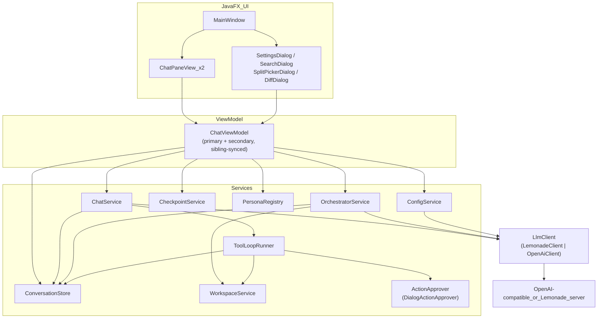

# MultiAgent Desktop (Java) — Architecture & User Guide

MultiAgent Desktop (Java) is a JavaFX port of [`desktop/`](../desktop) (the Electron/React client) — a **separate, parallel client** in the same repo, not a replacement. It connects to **Lemonade** or any other **OpenAI-compatible server** (NoLlama, LM Studio, vLLM, real OpenAI, ...) — save multiple named connections in Settings and switch between them, or pin different conversations to different servers. It supports switchable agent personas (pinned per conversation), folder-bound workspace chats with read/write/rename tools gated behind an approval dialog, orchestrator sessions that route work across specialists, and a side-by-side split view for comparing two conversations from the same folder. Messages persist to SQLite, conversations can be searched and exported, and AI file writes can be reviewed as a diff and reverted.

See [Differences from the Electron client](#10-differences-from-the-electron-client) for what this port intentionally does or doesn't carry over.

---

## Table of contents

1. [Overview](#1-overview)
2. [Architecture](#2-architecture)
3. [Project structure](#3-project-structure)
4. [Data & persistence](#4-data--persistence)
5. [Service surface](#5-service-surface)
6. [Features in detail](#6-features-in-detail)
7. [How to use](#7-how-to-use)
8. [Develop & build](#8-develop--build)
9. [Troubleshooting](#9-troubleshooting)
10. [Differences from the Electron client](#10-differences-from-the-electron-client)

---

## 1. Overview

| Concern      | Choice                                                                                                       |
| ------------ | -------------------------------------------------------------------------------------------------------------- |
| Shell        | JavaFX desktop app, single JVM process — no main/renderer split, no IPC                                          |
| UI           | JavaFX 21 controls, built in plain Java (no FXML) under `ui/` — `MainWindow` + `ui/components/*`                |
| State        | `ui/viewmodel/ChatViewModel` — an MVVM view model exposing JavaFX `ObservableList`/`Property` fields, two instances share one backend for split view (mirrors `chatStore.ts`'s factory pattern) |
| LLM          | `llm/` — `OpenAiClient` (generic OpenAI-compatible, via `java.net.http.HttpClient`), `LemonadeClient` (extends it with Lemonade's load-status extension), picked by `AppSettings.providerType` |
| Settings     | Jackson-backed JSON file → `%APPDATA%/MultiAgentJava/config.json`                                                |
| Chats        | SQLite via **sqlite-jdbc** (JDBC, no WASM) → `%APPDATA%/MultiAgentJava/chats.db`                                  |
| Build/run    | Maven — `mvn javafx:run` for the dev loop; no packaged installer yet (see [§8](#8-develop--build))               |

**Security rule, ported as-is:** all file-system access is still funneled through `WorkspaceService`'s sandboxed `resolveSafe()` (relative-path check plus a `Path.toRealPath()` symlink check), exactly like `shared/workspace/workspaceService.ts`. There's no separate process boundary to enforce it — this is a single JVM — but the workspace tools never touch a path outside the bound folder regardless of what a model asks for.

### Providers

`llm.LlmClient` is the interface (`checkHealth`, `listModels`, `listLoadedModelNames`, `supportsLoadStatus`, `ensureModelLoaded`, `streamChat`, `completeChat`, `supportsImageGeneration`) both implementations satisfy:

- **`OpenAiClient`** (`llm/OpenAiClient.java`) — any generic OpenAI-compatible server. Uses the JDK's own `HttpClient` for `/chat/completions` (SSE streaming via `streaming/SseLineReader.java`, and non-streaming `completeChat` with a `tools` payload for the agent loop) and `/models`. No load-status signal on the standard `/v1` surface, so `listLoadedModelNames()`/`supportsLoadStatus()` are honest about that (empty list, `false`) and `ensureModelLoaded` is a no-op.
- **`LemonadeClient`** (`llm/LemonadeClient.java`) — `extends OpenAiClient`, adding Lemonade's `/health` (parses `all_models_loaded`) and `POST /load` + poll-until-ready (1.5s interval, 10min timeout) on top of the inherited chat behavior.
- **Ollama** — not ported yet. `LlmClientFactory.create(ProviderType.OLLAMA, ...)` throws a clear `ProviderException` rather than silently misbehaving; `ProviderType` already has the `OLLAMA` enum value reserved for when it lands.

`LlmClientFactory.create(providerType, settings)` picks the implementation, mirroring `shared/llm/createLlmClient.ts`.

---

## 2. Architecture



### Layer roles

- **UI (`ui/`, `ui/components/`)** — plain-Java JavaFX construction (no FXML), reacting to `ChatViewModel`'s `ObservableList`/`Property` fields. `MainWindow` owns the sidebar (folder-grouped `TreeView`, bound to the primary view model only) and the global topbar (Search/Refresh/Settings/Close-split); `ChatPaneView` is the per-pane topbar+thread+composer, instantiated twice for split view.
- **ViewModel (`ui/viewmodel/ChatViewModel`)** — the MVVM layer and the seam that gives each conversation its own isolated state. Holds a `ConversationSession` per conversation id (streaming buffer, workspace-op list, error, orchestrator status) so switching the active conversation never carries over another one's in-flight state, and a `resolveModelFor`/`resolveServerFor`/`resolvePersonaFor` trio that reads each of those off the `Conversation` row itself rather than a single shared field — this is what makes model/server/persona genuinely per-chat (see [§10](#10-differences-from-the-electron-client) for why persona differs from the Electron app here). Background work runs on a per-instance executor and marshals results back via `Platform.runLater`.
- **Services (`service/`)** — `ChatService` (plain chat + delegates to `ToolLoopRunner` when a workspace is bound), `OrchestratorService` (plan → specialists → synthesize, with its own smaller read-only tool executor), `ToolLoopRunner` (the shared native-tool-calling/XML-tag/JSON-tool-call agent loop, factored out so `ChatService` and future callers don't duplicate it), `CheckpointService` (diff/revert), `PersonaRegistry`, `ConfigService`.
- **Persistence (`persistence/`)** — `ConversationStore` over `sqlite-jdbc`, `Migrations` (additive, `PRAGMA table_info`-guarded).
- **Workspace (`workspace/`)** — `WorkspaceService` (sandboxed list/read/write/delete/rename + tree-building), `ActionTagParser` and `JsonToolCallParser` (two independent fallbacks for models without reliable native tool-calling — see [§6](#6-features-in-detail)).
- **Action approval (`action/`, `ui/components/DialogActionApprover`)** — a small, deliberately generic interface (`ActionApprover.approve(PendingAction)`) sitting between the tool loop and execution, so any future mutating action type (not just files) can gate on the same "describe → ask → execute" pipeline without new plumbing.

### Chat request path (text)

1. User sends a message in the composer.
2. `ChatPaneView` → `ChatViewModel.sendMessage(text)`.
3. `ChatViewModel` resolves that conversation's own server/model/persona, then calls `ChatService.send(...)` on a background thread.
4. `ChatService` loads history, builds the system prompt (persona + workspace tree/instructions if a folder is bound), and either streams tokens directly from the `LlmClient` (plain chat) or hands off to `ToolLoopRunner` (workspace-bound chat), which runs up to 8 rounds of tool-call → execute → feed-result-back before returning one final answer.
5. Callbacks (`onToken`/`onDone`/`onError`/`onWorkspaceOp`) land on `ChatViewModel`'s `Listener`, which updates that conversation's `ConversationSession` and, via `Platform.runLater`, the observable properties the UI is bound to.

For `kind == ORCHESTRATOR`, `ChatViewModel` calls `OrchestratorService.send(...)` instead, which drives its own plan/specialist/synthesize sequence and reports progress through `onStep`/`onMessagesUpdated`.

### Tool-calling agent loop (`ToolLoopRunner`)

Each round: call `completeChat(messages, model, tools)`, then look for an action to execute, in order:

1. **Native tool calls** — the server's own `tool_calls` response field (works when the server/model combination actually supports OpenAI-style function calling and returns it correctly).
2. **XML action tags** (`ActionTagParser`) — `<write_file path="...">content</write_file>`-style tags, for models instructed via the system prompt to use them instead of native calling.
3. **JSON tool-call text** (`JsonToolCallParser`) — some tool-tuned models (Qwen2.5-Coder via Lemonade/llama.cpp is the concrete case this was built for) print the `{"name": "write_file", "arguments": {...}}` shape they were fine-tuned to emit as plain text — bare, in a ```json fence, or inside `<tool_call>` tags — instead of either of the above. This fallback recognizes only the app's known tool names, so it can't misfire on unrelated JSON in an answer.

Whichever path matches, mutating tools (`write_file`/`delete_file`/`rename_file`) are gated through `ActionApprover.approve(PendingAction)` before they touch disk — a declined action returns `"Error: User declined this action."` as the tool result (so the model can adapt) without executing or capturing a checkpoint. Read-only tools (`list_dir`/`read_file`) never prompt. If no approver is installed, calls auto-approve — a testing convenience only; `App.java` always installs a real `DialogActionApprover` for the running app.

---

## 3. Project structure

`desktop-java/` is a Maven module at the repo root, alongside `desktop/` and `vscode-extension/`. It reuses `personas/*.json` from the repo root (copied into `target/classes/personas` at build time) but does **not** read `shared/` — that's TypeScript; the equivalent logic (`LlmClient`, `WorkspaceService`, action-tag parsing) is reimplemented in Java under this module.

```
MultiAgent/
  desktop-java/
    pom.xml
    src/main/java/com/multiagent/desktop/
      App.java                        # JavaFX Application entry point
      action/
        PendingAction.java            # record: category, summary, detail (preview text)
        ActionApprover.java           # approve(PendingAction): boolean
      llm/
        LlmClient.java  ProviderException.java (+ ErrorCode)  ProviderSettings.java
        ChatCompletionResult.java  ChatRequestMessage.java  ToolCall.java  ToolDefinition.java
        OpenAiClient.java  LemonadeClient.java  LlmClientFactory.java
        streaming/SseLineReader.java
      workspace/
        WorkspaceService.java         # sandboxed list/read/write/delete/rename + tree
        ActionTagParser.java          # XML action-tag fallback
        JsonToolCallParser.java       # JSON-shaped tool-call text fallback
        WorkspaceException.java
      persistence/
        ConversationStore.java  Migrations.java
      service/
        ChatService.java              # plain chat + workspace delegation
        ToolLoopRunner.java           # shared tool-calling agent loop
        OrchestratorService.java      # plan -> specialists -> synthesize
        CheckpointService.java        # diff/revert
        PersonaRegistry.java  ConfigService.java  ExportFormat.java  PlanParser.java
      model/
        Persona.java  Conversation.java  ConversationKind.java  ChatMessage.java  MessageRole.java
        ServerProfile.java  ProviderType.java  AppSettings.java  ThemeMode.java
        ModelInfo.java  HealthStatus.java  FolderEntry.java  SearchResult.java
        FileCheckpoint.java  CheckpointDiff.java
      ui/
        MainWindow.java                # sidebar + global topbar + split layout + theming
        viewmodel/ChatViewModel.java   # ConversationSession-per-chat isolation, sibling sync
        viewmodel/WorkspaceOpEntry.java
        components/
          ChatPaneView.java            # per-pane topbar + thread + composer (x2 for split view)
          ChatThread.java  Composer.java
          SettingsDialog.java  ServerEditDialog.java
          SearchDialog.java  SplitPickerDialog.java  DiffDialog.java
          DialogActionApprover.java    # the "ask before writing/deleting/renaming" dialog
    src/main/resources/com/multiagent/desktop/ui/
      styles.css  theme-dark.css  theme-terminal.css
    src/test/java/com/multiagent/desktop/...   # JUnit 5, one test class per main class above
  desktop/            # Electron client (untouched by this module)
  vscode-extension/   # VS Code client (untouched by this module)
  shared/             # TS-only; read as reference during the port, not depended on
  personas/           # General, Researcher, Coder, Critic, Orchestrator - shared source of truth
```

---

## 4. Data & persistence

### Settings (Jackson JSON file)

| Field            | Default                         | Purpose                                                                       |
| ---------------- | -------------------------------- | ------------------------------------------------------------------------------ |
| `providerType`    | `lemonade`                       | `lemonade` or `openai` (`ollama` accepted in config but rejected at connect time) |
| `baseUrl`         | `http://localhost:13305/api/v1`  | Active connection's server API base                                             |
| `apiKey`          | `local-llm`                      | Required by the OpenAI client shape; unused by Lemonade                         |
| `model`           | `""`                              | Fallback chat/orchestrator model for conversations without their own            |
| `maxHistory`      | `40`                              | Max messages sent as history                                                    |
| `theme`           | `light`                           | `light` \| `dark` \| `terminal`                                                 |
| `servers`         | `[]`                              | Saved `ServerProfile` list (id, name, providerType, baseUrl, apiKey, maxHistory) |
| `activeServerId`  | `null`                            | Id of the `servers` entry currently copied into the active-connection fields    |

`ConfigService.ensureDefaultServer()` seeds one profile from the active-connection fields on first run if `servers` is empty, exactly mirroring `electron/config.ts`'s `ensureDefaultServer()`.

Path: `%APPDATA%/MultiAgentJava/config.json` (its own folder — deliberately separate from the Electron app's `%APPDATA%/MultiAgent/`, since the two clients' config shapes aren't guaranteed to round-trip through each other, even though the field names read the same).

### Conversations / messages (SQLite via sqlite-jdbc)

- `conversations(id, title, createdAt, updatedAt, workspacePath, kind, model, serverId, personaId)` — `personaId` is a Java-client-only addition (see [§10](#10-differences-from-the-electron-client)); everything else matches the Electron schema field-for-field.
- `messages(id, conversationId, role, content, personaId, createdAt)`, indexed on `(conversationId, createdAt)`.
- `folders(path, addedAt)`.
- `file_checkpoints(id, conversationId, relativePath, previousContent, previousExisted, createdAt)` — one row per successful `write_file`/`delete_file`, capturing pre-op content (`previousContent: null` + `previousExisted: false` means the op created the file).

Every `ALTER TABLE` in `Migrations.run()` is guarded by a `PRAGMA table_info` check first, so re-running it against an existing db is always a no-op if the column is already there.

Path: `%APPDATA%/MultiAgentJava/chats.db`

---

## 5. Service surface

There's no IPC layer in this client — `ChatViewModel` calls services directly, in-process. The equivalent "contract" is:

| Entry point | Shape | Purpose |
| --- | --- | --- |
| `ChatService.send(client, conversation, content, persona, model, maxHistory, listener)` | async, callback-based | Runs one chat turn (plain or workspace tool loop) on a background thread |
| `ChatService.Listener` | interface | `onToken` / `onDone` / `onError` / `onWorkspaceOp` / `onStep` / `onMessagesUpdated` — the callback contract both `ChatService` and `OrchestratorService` report through |
| `OrchestratorService.send(...)` | async, callback-based | Same `Listener` contract, drives the plan → specialists → synthesize sequence |
| `ChatService.cancel(conversationId)` / `OrchestratorService.cancel(conversationId)` | sync | Cancels that conversation's in-flight `CancellationToken` — per-conversation, not global |
| `ChatService.setActionApprover(approver)` | sync | Installs the write/delete/rename confirmation gate |
| `CheckpointService.diff(checkpointId)` / `.revert(checkpointId)` | sync | Backing calls for the chat thread's View diff / Revert buttons |
| `ConversationStore.*` | sync, JDBC | CRUD + `search()` + folder/checkpoint tables — called directly by `ChatViewModel`, no separate repository-of-repositories layer |

`ChatViewModel` exposes the UI-facing half of this as JavaFX bindable state (`conversations()`, `messages()`, `activeConversationProperty()`, `streamingProperty()`, `errorMessageProperty()`, etc.) plus action methods (`sendMessage`, `newConversation`, `setPersona`, `setModel`, `setServer`, `search`, `exportConversation`, `diffCheckpoint`/`revertCheckpoint`, ...) that wrap the calls above with the per-conversation session bookkeeping described in [§2](#2-architecture).

---

## 6. Features in detail

### Personas

Loaded from `personas/*.json` at the repo root (`PersonaRegistry`, sorted general/researcher/coder/critic first, then alphabetically, with a hard-coded fallback if the directory can't be found). Unlike the Electron app, **persona is pinned per conversation** here (`Conversation.personaId`), not a single pane-wide field — see [§10](#10-differences-from-the-electron-client).

### Folders

**+ Add folder** in the sidebar registers a folder (native `DirectoryChooser`); it appears as a group in the folder-grouped `TreeView`. Right-click a folder → **New chat here** / **New orchestrator here** creates a session bound to it. Once a folder has 2+ conversations, its right-click menu also offers **Side by side**.

### Side by side (split view)

Right-click a folder with 2+ conversations → **Side by side** opens `SplitPickerDialog` (Left/Right pickers over that folder's conversations). Two `ChatViewModel` instances — constructed once in `App.java`, sharing the same `ChatService`/`OrchestratorService`/`CheckpointService`/`ConversationStore` — are registered as siblings (`addSibling`); a create/delete/rename in either pane calls `notifySiblings()` so the other instance (and the sidebar, always bound to the primary instance) refreshes immediately. Each instance's `ConversationSession` map keeps their streaming/error/workspace-op state fully independent, and each runs its own `CancellationToken`, so sending in both panes at once starts two independent generations rather than one cancelling the other.

### Workspace-assisted chats

A chat created from a folder has `workspacePath` set for its whole lifetime (fixed at creation). When bound:

- The system prompt gets the workspace's directory tree plus tool-usage instructions.
- Tools available: `list_dir`, `read_file`, `write_file`, `delete_file`, `rename_file` (`generate_image` is defined in the tool schema for forward-compat but rejected by `WorkspaceService.executeTool` — image generation isn't ported).
- **Mutating tools ask first** — see [Approval gate](#approval-gate-for-file-writesdeletesrenames) below. This is new relative to the Electron app.
- **Safety**, unchanged from the TS original: every path resolves under the workspace root via `WorkspaceService.resolveSafe()` — a plain `..`-rejection check, then a `Path.toRealPath()` symlink-resolved check so a symlink planted inside the workspace can't point files outside it. `node_modules`/`.git`/`dist`/etc. are skipped when building the tree.

### Approval gate for file writes/deletes/renames

Every `write_file`/`delete_file`/`rename_file` call — whether it arrived as a native tool call, an XML tag, or JSON tool-call text — is intercepted by `ToolLoopRunner` before execution and routed through `ActionApprover.approve(PendingAction)`. The installed implementation, `DialogActionApprover`, shows a JavaFX confirmation dialog on the FX Application Thread (parented to the main window) with:

- A bold summary line (e.g. "Write `src/HelloWorld.java` (125 bytes)", "Delete `notes.txt`", "Rename `old.txt` → `new.txt`")
- An expandable preview: the content being written, the existing file's content for a delete, nothing extra for a rename

...and blocks the calling (background, tool-loop) thread on the result via a `CompletableFuture`. Declining returns a clean tool-result error to the model instead of executing anything or capturing a checkpoint. The gate is deliberately generic (`PendingAction` just carries a category/summary/detail) so a future action type — a git command, for instance — could plug into the exact same interface without new UI plumbing.

### Diff & undo for AI file writes

Every successful `write_file`/`delete_file` captures a checkpoint (`ToolLoopRunner.runToolAndEmit`, via `WorkspaceService.tryReadFile` — a `readFile` variant returning `null` instead of throwing for a missing file) into `file_checkpoints`, attached to that op's `onWorkspaceOp` event as a `checkpointId`. The tool-activity line for that op (rendered under the assistant's message, and left visible after streaming ends — not just during it) gets **View diff** / **Revert** buttons:

- **View diff** (`CheckpointService.diff`) — a unified line diff (`java-diff-utils`) between the checkpoint's `previousContent` and the file's current content on disk, shown in `DiffDialog`.
- **Revert** (`CheckpointService.revert`) — restores `previousContent`, or deletes the file if `previousExisted` was `false`. One-shot; no redo stack.

### Orchestrator sessions

**+ Orchestrator** creates a `kind: ORCHESTRATOR` conversation. Each user message runs: **Plan** (orchestrator persona picks 1-3 specialists from researcher/coder/critic via a small JSON-only completion, parsed by `PlanParser`) → **Specialists** (each runs in turn, with read-only `list_dir`/`read_file` tools only if a workspace is bound — never write/delete/rename — persisted as its own message as it completes) → **Synthesize** (final streamed answer from the specialist notes). Progress surfaces via `onStep` events into `orchestratorStatusProperty()`.

### Message search & export

**Search** (global topbar) calls `ConversationStore.search(term)` — a `LIKE` match (SQL wildcards escaped) against conversation titles first, then message content, capped at 30 results, deduped by conversation. Each conversation's right-click menu offers **Export as Markdown** / **Export as JSON** (`ExportFormat`), saved via a native `FileChooser` with a slugified-title default filename.

### Themes

Three complete, self-contained stylesheets (`styles.css` / `theme-dark.css` / `theme-terminal.css`) swapped wholesale on the `Scene` (`MainWindow.applyTheme`) rather than layered — each overrides Modena's base variables (`-fx-base`, `-fx-background`, `-fx-control-inner-background`, `-fx-text-base-color`) so stock JavaFX controls pick up the theme too, plus this app's own custom style classes. **Terminal** is a black-background, `#33ff33`-text, monospace, square-cornered 1980s-green-screen look. Picked in Settings (applies immediately, persisted to `AppSettings.theme`).

---

## 7. How to use

### Prerequisites

1. JDK 21+ and Maven (or use IntelliJ's bundled Maven support — the project opens directly via `pom.xml`).
2. Install and start [Lemonade Server](https://lemonade-server.ai/), or point Settings at any OpenAI-compatible server.
3. Default API: `http://localhost:13305/api/v1`.

### First run

```bash
cd desktop-java
mvn javafx:run
```

Or in IntelliJ: open `desktop-java/pom.xml` as a project, then run the `MultiAgent (javafx-run)` shared run configuration (`.run/MultiAgent (javafx-run).run.xml`), or `App.main()` directly (JavaFX's Maven plugin isn't required if the module path is already resolved by the IDE).

### Workspace-assisted chat

1. Click **+ Add folder**, pick a folder.
2. Right-click its name in the sidebar → **New chat here**.
3. Ask the model to inspect or edit files. Watch tool activity in the thread; a confirmation dialog appears before any write/delete/rename actually happens on disk.

### Orchestrator

1. Click **+ Orchestrator**.
2. Ask a question. Watch the status banner while specialists run; each reply appears in the thread as it completes, followed by the final synthesis.

### Side by side

1. Make sure a folder has at least 2 conversations.
2. Right-click the folder → **Side by side** → pick Left/Right → **OK**.
3. **× Close split** (global topbar) hides the second pane without deleting either conversation.

---

## 8. Develop & build

### Development loop

```bash
cd desktop-java
mvn javafx:run
```

### Tests

```bash
mvn test
```

JUnit 5, one test class per main class (`ConversationStoreTest`, `WorkspaceServiceTest`, `ActionTagParserTest`, `JsonToolCallParserTest`, `ChatServiceApprovalTest`, `ChatViewModelSiblingSyncTest`, `ChatViewModelPersonaIsolationTest`, ...) — 100+ tests, mirroring the intent of the TS suite's coverage (migrations/search, symlink-escape sandboxing, action-tag parsing, per-conversation isolation) rather than porting individual test files 1:1.

### Packaging

**Not implemented yet.** There's no `jpackage`/native-installer step in `pom.xml` — today this module is dev-run-only via `mvn javafx:run`. A packaged Windows installer (jlinked JRE + jpackage, so end users don't need a separate Java install) is a natural next step but hasn't been built.

---

## 9. Troubleshooting

| Symptom                          | Likely cause                                          | What to try                                                        |
| --------------------------------- | ------------------------------------------------------- | --------------------------------------------------------------------- |
| Health badge / status shows offline | Server not running, wrong URL, or wrong provider type   | Start the server; check Settings base URL and provider type          |
| Empty model list                  | Server up but no models loaded                          | Pull/run a model on the server                                       |
| Model never becomes "ready" (Lemonade) | `/load` failing or model too large for available memory | Check Lemonade's own logs; try a smaller model                        |
| Confirmation dialog never appears for a write | Model didn't emit a recognized tool call at all (see [ToolLoopRunner](#tool-calling-agent-loop-toolloopruner)) | Check the raw assistant text in the thread — if it's describing the action in prose instead of emitting one of the three recognized shapes, that model/server combination isn't reliably tool-calling; try a different model or provider |
| Tool / write errors               | Path outside workspace, or targeting an ignored dir      | Stay under the bound folder; avoid `..`                               |
| `mvn: command not found`          | Maven not on PATH                                       | Install Maven, or open the project in an IDE with bundled Maven support |
| JEP 472 / `Unsafe` warnings on startup | JDK 21's restricted-method warnings from JavaFX/sqlite-jdbc native loading | Cosmetic — already partly silenced via `--enable-native-access` in the javafx-maven-plugin config; harmless otherwise |

### Useful paths

- Settings: `%APPDATA%\MultiAgentJava\config.json`
- Database: `%APPDATA%\MultiAgentJava\chats.db`

---

## 10. Differences from the Electron client

Intentional, not oversights:

| Area | Electron (`desktop/`) | Java (`desktop-java/`) | Why |
| --- | --- | --- | --- |
| Persona scope | One pane-wide field (`chatStore.ts`'s `activePersonaId`) | Pinned per conversation (`Conversation.personaId`) | Per-chat isolation was a hard requirement for this port from the start; carrying the Electron app's shared-field behavior over would have reintroduced the exact class of "state leaks between chats" bug this port went out of its way to avoid elsewhere (model, server, streaming, errors) |
| Mutating file tools | Execute immediately, no confirmation | Gated behind `ActionApprover`/`DialogActionApprover` — every write/delete/rename asks first | Added specifically for this client; a generic enough interface that other action types (e.g. git commands) can reuse it later |
| Tool-call detection | Native tool calls, then XML action-tag fallback | Native tool calls, then XML action-tag fallback, **then a JSON-tool-call-text fallback** (`JsonToolCallParser`) | Found live against Qwen2.5-Coder + Lemonade: the model ignores both the native tool-calling field and this app's XML tags, printing the JSON shape it was fine-tuned to emit instead |
| `rename_file` tool | Not present | Present (`WorkspaceService.renameFile`, XML tag, JSON fallback) | Added during this port; not back-ported to the TS side |
| Ollama provider | Supported (`OllamaClient`, NDJSON) | Not ported — `ProviderType.OLLAMA` is recognized in config but `LlmClientFactory` throws a clear "not yet supported" error | Deferred; Lemonade and generic OpenAI-compatible servers cover the primary use case |
| Image generation | Full (`ImageService`, image sessions, gallery) | Not ported (explicitly out of scope for this migration) | Deprioritized early in planning — plain/workspace chat and orchestrator were the priority |
| Packaging | NSIS installer (Windows), AppImage (Linux) | None yet — `mvn javafx:run` only | Not yet built; see [§8](#8-develop--build) |
| Process model | Electron main/renderer + IPC + `contextBridge` | Single JVM, `ChatViewModel` calls services directly | No separate untrusted-renderer boundary to defend in a JavaFX desktop app the way there is in an app that also renders arbitrary web content |
| Settings/DB location | `%APPDATA%\MultiAgent\` | `%APPDATA%\MultiAgentJava\` | Deliberately separate so the two clients never fight over the same files or assume config-shape compatibility |

Everything else — folders, side-by-side split view, per-conversation server pinning, search, export, checkpoint diff/revert, three themes, the orchestrator's plan/specialist/synthesize flow, the workspace sandboxing rules — is a faithful behavioral port.
