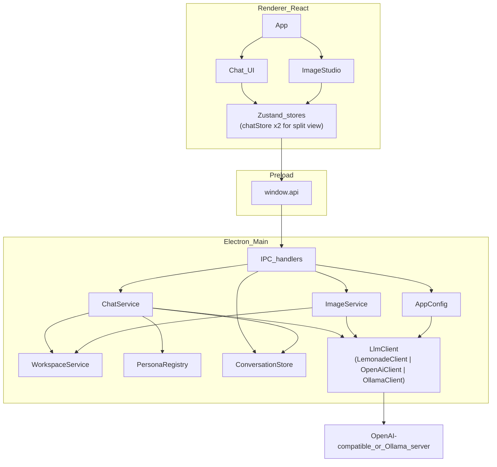

# MultiAgent — Architecture & User Guide

MultiAgent is a Windows desktop app (Electron + React) for chatting with local models. It connects to **Lemonade**, any other **OpenAI-compatible server** (NoLlama, LM Studio, vLLM, real OpenAI, ...), or a **native Ollama server** — save multiple named connections in Settings and switch between them without restarting. It supports switchable agent personas, folder-bound workspace chats with read/write tools, dedicated image sessions, **orchestrator** sessions that route work across specialists, and a **side-by-side split view** for comparing two conversations from the same folder.

---

## Table of contents

1. [Overview](#1-overview)
2. [Architecture](#2-architecture)
3. [Project structure](#3-project-structure)
4. [Data & persistence](#4-data--persistence)
5. [IPC contract](#5-ipc-contract)
6. [Features in detail](#6-features-in-detail)
7. [How to use](#7-how-to-use)
8. [Develop & package](#8-develop--package)
9. [Troubleshooting](#9-troubleshooting)

---

## 1. Overview

| Concern      | Choice                                                                                                                                                                                                           |
| ------------ | ---------------------------------------------------------------------------------------------------------------------------------------------------------------------------------------------------------------- |
| Shell        | Electron (main + preload + renderer)                                                                                                                                                                             |
| UI           | React 19 + TypeScript + Vite                                                                                                                                                                                     |
| State        | Zustand (`chatStore` — a factory, two instances for split view — plus `settingsStore`, `splitViewStore`)                                                                                                         |
| LLM / images | `shared/llm/` — `OpenAiClient` (generic OpenAI SDK + raw HTTP), `LemonadeClient` (extends it with Lemonade's load-status extension), or `OllamaClient` (native Ollama API), picked by `AppSettings.providerType` |
| Settings     | `electron-store` → `%APPDATA%/MultiAgent/config.json`                                                                                                                                                            |
| Chats        | SQLite via **sql.js** → `%APPDATA%/MultiAgent/chats.db`                                                                                                                                                          |
| Images cache | `%APPDATA%/MultiAgent/images/*.png`                                                                                                                                                                              |
| Packaging    | `electron-builder` NSIS (Windows x64)                                                                                                                                                                            |

**Security rule:** the renderer never calls the LLM server directly. All network I/O, file system access, and dialogs run in the Electron **main** process and are exposed through a typed `window.api` bridge (preload + `contextIsolation`).

### Providers

`shared/llm/types.ts` defines an `LlmClient` interface (`checkHealth`, `listModels`, `listLoadedModelNames`, `ensureModelLoaded`, `streamChat`, `completeChat`, `generateImage`, `supportsImageGeneration`) that both client implementations satisfy, so `ChatService`/`OrchestratorService`/`ImageService` are written once against whichever provider is active:

- **`OpenAiClient`** (`shared/llm/openAiClient.ts`) — any generic OpenAI-compatible server (NoLlama, LM Studio, vLLM, real OpenAI, ...). Uses the `openai` SDK for `/v1/chat/completions` and `/v1/models`. Since the standard `/v1` surface has no load-status signal, `listLoadedModelNames()`/`supportsLoadStatus()` are honest about that (empty list, `false`) rather than guessing, and `ensureModelLoaded` is a no-op — these servers manage loading themselves, so a hard-coded assumption would either falsely report "not loaded" forever or call an endpoint that doesn't exist.
- **`LemonadeClient`** (`shared/llm/lemonadeClient.ts`) — `extends OpenAiClient`, adding Lemonade's non-standard `/health` + `/load` extension on top of the inherited chat/completion behavior: `listLoadedModelNames()` parses `/health`'s `all_models_loaded` array, `supportsLoadStatus()` reflects whether that probe actually returned real data, and `ensureModelLoaded` explicitly calls `/load` then polls until the model shows as loaded (or times out).
- **`OllamaClient`** (`shared/llm/ollamaClient.ts`) — native Ollama protocol: `POST /api/chat` (NDJSON streaming, not SSE), `GET /api/tags` for model listing, `GET /api/ps` for currently-loaded models (best-effort — not every Ollama-compatible server implements it; falls back to an empty list and `supportsLoadStatus() === false`), `POST /api/generate` with no prompt to trigger on-demand loading. Ollama assigns no id to tool calls and sends `arguments` as an object rather than a JSON string, so `completeChat` synthesizes an id and re-serializes arguments to match the shape `OpenAiClient` produces. **Has no image-generation endpoint** — `generateImage` always rejects with a `'unsupported'` `ProviderError`, and `ImageStudio` disables the Generate button with an explanation when this provider is active.

`createLlmClient(providerType, settings)` (`shared/llm/createLlmClient.ts`) picks the implementation. `handlers.ts` holds the active client behind a `getClient()`/`setClient()` pair (mirroring the `getSettings`/`getWindow` getter pattern already used elsewhere) and rebuilds it on every `settings:set`, so switching provider type in Settings takes effect immediately without restarting the app.

> **Compatibility note:** [NoLlama](https://github.com/aweussom/NoLlama) exposes both an OpenAI-compatible endpoint (port 8000, its primary/recommended interface) and an Ollama-compatible one (port 11434). As of testing, NoLlama's Ollama-compat `/api/chat` and `/api/generate` don't reliably honor the requested `model`/`prompt` — verified independently of this app via raw HTTP requests. Prefer the OpenAI-compatible provider pointed at NoLlama's port 8000 rather than the Ollama provider pointed at port 11434.

---

## 2. Architecture



### Process roles

- **Main** — window lifecycle, IPC, LLM server HTTP, SQLite, workspace file tools, image generation/save/download.
- **Preload** — exposes a safe `window.api` surface via `contextBridge`.
- **Renderer** — React UI only; talks to main through IPC invoke/events.

### Chat request path (text)

1. User sends a message in the composer.
2. Renderer → `chat:send` with `conversationId`, `content`, `personaId`.
3. `ChatService` loads history, injects persona system prompt (and workspace instructions if a folder is bound).
4. Streams tokens from the active `LlmClient` (`chat:token` events) or runs a workspace tool loop.
5. Persists assistant message; emits `chat:done` / `chat:error`.

For `kind: 'orchestrator'`, `ChatService` delegates to `OrchestratorService` (plan → specialists → synthesize).

### Image request path

1. User opens an **image** conversation and fills the Image Generator panel (disabled if the active provider is Ollama).
2. Renderer → `images:generate`.
3. `ImageService` calls the active `LlmClient`'s `generateImage` (OpenAI-compatible servers only — `POST /images/generations`, b64 PNG).
4. File is cached under `userData/images/`; optionally written into the bound workspace folder.
5. An assistant message with `[[MA_IMAGE]]…[[/MA_IMAGE]]` metadata is stored for preview / download / save.

---

## 3. Project structure

`desktop/` is one of two clients in the MultiAgent repo (the other being `../vscode-extension/`); `shared/` and `personas/` live at the repo root, one level above `desktop/`, so both clients read the same definitions.

```
MultiAgent/
  desktop/
    electron/
      main.ts                 # BrowserWindow, app lifecycle
      preload.ts              # contextBridge → window.api
      config.ts               # electron-store settings + ensureDefaultServer() migration
      ipc/
        channels.ts           # channel name constants
        handlers.ts           # IPC registration + service wiring
      services/
        chatService.ts        # chat + workspace agent loop
        orchestratorService.ts # plan → specialists → synthesize
        conversationStore.ts  # sql.js persistence
        personaRegistry.ts    # load ../../personas/*.json (dev) or extraResources (packaged)
        imageService.ts       # generate, cache, download, save
        modelStatus.ts        # emitModelStatus() IPC helper
    src/                      # React renderer
      App.tsx                 # global topbar + main pane + split pane wiring
      components/             # UI pieces (ChatThread, Composer, SplitPane, SplitPickerModal, ...)
      store/
        chatStore.ts          # pane-store factory - useChatStore (primary) + useSecondaryChatStore (split view)
        settingsStore.ts      # server connection, models, theme
        splitViewStore.ts     # side-by-side open/picker state
      styles.css
    package.json
    vite.config.ts
    README.md
  vscode-extension/           # VS Code client (see ../vscode-extension/README.md)
  shared/
    types.ts                  # shared TS types + image message helpers
    llm/                      # LlmClient interface + OpenAiClient/LemonadeClient/OllamaClient/createLlmClient
    workspace/                # WorkspaceService (safe list/read/write/delete) + action-tag XML fallback parser
  personas/                   # General, Researcher, Coder, Critic, Orchestrator
```

---

## 4. Data & persistence

### Settings (`electron-store`)

| Key              | Default                         | Purpose                                                                           |
| ---------------- | ------------------------------- | --------------------------------------------------------------------------------- |
| `providerType`   | `lemonade`                      | `'lemonade'`, `'openai'` (any other OpenAI-compatible server), or `'ollama'`      |
| `baseUrl`        | `http://localhost:13305/api/v1` | Active connection's server API base (`http://localhost:11434` default for Ollama) |
| `apiKey`         | `local-llm`                     | Required by the OpenAI client; unused by Lemonade/Ollama                          |
| `model`          | `""`                            | Fallback chat/orchestrator model for conversations that haven't set their own     |
| `imageModel`     | `""`                            | Fallback image model for image sessions that haven't set their own                |
| `maxHistory`     | `40`                            | Max messages sent as history                                                      |
| `theme`          | `light`                         | UI theme (`light` \| `dark`), toggled in Settings                                 |
| `servers`        | `[]`                            | Saved `ServerProfile[]` (name, providerType, baseUrl, apiKey, maxHistory)         |
| `activeServerId` | `null`                          | Id of the `servers` entry currently copied into the fields above                  |

`providerType`/`baseUrl`/`apiKey`/`maxHistory` are the _active connection_ — switching servers in Settings copies the selected profile's fields into these rather than every consumer reading `servers[activeServerId]` directly, so `getClient()`/`setClient()` keep working unchanged. `ensureDefaultServer()` (`electron/config.ts`) seeds one profile from these fields on first run if `servers` is empty, so existing configs aren't lost.

Path: `%APPDATA%/MultiAgent/config.json`

### Conversations / messages (SQLite via sql.js)

Tables:

- `conversations(id, title, createdAt, updatedAt, workspacePath, kind, model)`
  - `kind`: `'chat'` | `'image'` | `'orchestrator'`
  - `model`: the model id used for this conversation specifically, or `null` to fall back to the global default (`AppSettings.model` / `imageModel`). Set independently per conversation via the top-bar/toolbar model picker — changing it in one chat never affects another chat, an orchestrator, or an image session, even within the same folder.
- `messages(id, conversationId, role, content, personaId, createdAt)`
- `folders(path, addedAt)` — folders opened via **Open folder**; also backfilled once from any pre-existing `conversations.workspacePath`

Path: `%APPDATA%/MultiAgent/chats.db`

### Generated images

- Cache: `%APPDATA%/MultiAgent/images/<uuid>.png`
- Message content embeds JSON between `[[MA_IMAGE]]` / `[[/MA_IMAGE]]` (file name, prompt, model, size, optional workspace relative path).

---

## 5. IPC contract

| Channel                                   | Direction | Purpose                                               |
| ----------------------------------------- | --------- | ----------------------------------------------------- |
| `settings:get` / `settings:set`           | invoke    | Read/update app settings                              |
| `models:list`                             | invoke    | List models from the active provider                  |
| `health:check`                            | invoke    | Ping `/models`                                        |
| `personas:list`                           | invoke    | Built-in personas                                     |
| `chat:send` / `chat:cancel`               | invoke    | Start / abort completion                              |
| `chat:token` / `chat:done` / `chat:error` | event     | Streaming lifecycle                                   |
| `conversations:*`                         | invoke    | list/create/rename/setModel/delete/get                |
| `messages:list`                           | invoke    | Load thread                                           |
| `folders:list`                            | invoke    | List opened folders                                   |
| `folders:open`                            | invoke    | Native folder picker + register in `folders`          |
| `workspace:op`                            | event     | Tool progress (list/read/write/delete/generate_image) |
| `images:generate`                         | invoke    | Generate + persist message                            |
| `images:getDataUrl`                       | invoke    | Preview cached PNG                                    |
| `images:download`                         | invoke    | Save-as dialog                                        |
| `images:saveToWorkspace`                  | invoke    | Copy into bound folder                                |

---

## 6. Features in detail

### Personas

JSON profiles under `personas/`:

| Id             | Role                                                         |
| -------------- | ------------------------------------------------------------ |
| `general`      | Concise all-purpose assistant                                |
| `researcher`   | Structured, evidence-oriented                                |
| `coder`        | Practical code-focused                                       |
| `critic`       | Challenges assumptions                                       |
| `orchestrator` | Supervisor used in orchestrator sessions (plan + synthesize) |

Switching persona mid-thread changes the **system prompt for the next reply only**. Past messages keep their `personaId` label/color. In orchestrator sessions the persona switcher is hidden; routing is automatic.

### Folders

Click **Open folder** (same row as New chat / New image / New orchestrator) to register a folder — it appears as a group in the sidebar. Right-click a folder's name to create a **New chat**, **New image**, or **New orchestrator** session bound to it; all sessions created that way are listed nested under that folder. The plain top-level New chat / New image / New orchestrator buttons always create folder-less sessions — there is no folder picker in the creation dialog. A conversation's folder binding is fixed at creation and can't be changed afterward. Once a folder has 2+ conversations, its right-click menu also offers **Side by side** (see below).

### Side by side (split view)

Right-click a folder with 2+ conversations → **Side by side** opens a picker (Left / Right dropdowns, populated with that folder's chat/orchestrator/image conversations). Confirming shows both at once, split-screen, each fully independent — own messages, streaming state, persona, and model.

- **State:** `src/store/chatStore.ts` exports a `createChatStore()` factory; `useChatStore` (left/primary pane) and `useSecondaryChatStore` (right pane) are two separate instances of it. Both register themselves in a small in-module sibling list so a create/delete/rename in either pane pushes the refreshed `conversations`/`folders` list into the other immediately (and into the sidebar, which is always bound to the primary instance) — otherwise the second pane's mutations would only surface in the sidebar on the sidebar's own next unrelated action.
- **Streaming isolation:** IPC events (`chat:token`, `chat:done`, `chat:error`, `workspace:op`, `orchestrator:step`) are dispatched to both store instances from `App.tsx`; each store's own reducer ignores events whose `conversationId` doesn't match its own `activeConversationId`, so tokens/errors/tool-ops never leak from one pane into the other.
- **Generation is still serialized backend-wide:** `ChatService`/`OrchestratorService` each track a single in-flight `AbortController`, so only one generation (one chat/image, or one orchestrator run) can be in flight at a time even with two panes open. `Composer`/`ImageStudio` disable Send/Generate (with an explanatory tooltip) whenever the _other_ pane is streaming or generating, rather than silently cancelling it the way a second `chat:send` would.
- **Layout:** the connection badge, Models, and Settings buttons live in a `.global-topbar` above both panes (not inside either pane's own topbar), since they're connection-level, not per-conversation. Each pane's own topbar only holds persona/model — this is also what keeps the two panes' topbar rows the same height and visually aligned regardless of which conversation kinds are shown side by side. A "× Close split" button appears in the global topbar while split view is open; closing it hides the second pane without deleting its conversation.

### Workspace chats

A chat created from a folder (right-click → New chat) has that path stored on the conversation for the whole session.

When a workspace is set, `ChatService` may:

- Inject a directory tree into the system prompt
- Expose tools: `list_dir`, `read_file`, `write_file`, `delete_file`, `generate_image`
- Fall back to XML action tags if native tool calls are unavailable

**Safety:** all paths are resolved under the workspace root; escaping (`..`) is rejected. Certain directories are ignored in trees (`node_modules`, `.git`, `dist`, …). Size limits apply to reads/writes.

### Image sessions

**New image** creates a conversation with `kind: 'image'`. The main pane shows **Image Generator** (steps, CFG, width/height, seed, prompt, model chip).

- Results appear in the session gallery with **Download** and **Save to folder** (folder save disabled unless the session was created from a folder — see [Folders](#folders)).
- Chat models cannot generate images; load an image model in Lemonade (e.g. `SD-Turbo`, `Qwen-Image-GGUF`).

### Orchestrator sessions

**New orchestrator** creates a conversation with `kind: 'orchestrator'`. Each user message runs a multi-step workflow:

1. **Plan** — Orchestrator persona chooses which specialists to consult (`researcher`, `coder`, `critic`).
2. **Specialists** — Each selected persona answers in turn; replies appear in the thread with their chip/color.
3. **Synthesize** — Orchestrator streams a final answer from the specialist notes.

Progress is shown in a status banner (`orchestrator:step` events). An orchestrator session can be bound to a folder like any other (right-click → New orchestrator): the planning, specialist, and synthesis steps all see the workspace tree, and specialists get read-only `list_dir`/`read_file` tools (no write/delete/generate — those stay exclusive to workspace chats) to inspect actual file contents before answering.

### Optional title

When creating a session, an optional **Title** field is available. If empty, defaults to `New chat` / `New image` / `New orchestrator` (then may auto-update from the first user prompt).

---

## 7. How to use

### Prerequisites

1. Install [Node.js 20+](https://nodejs.org/).
2. Install and start [Lemonade Server](https://lemonade-server.ai/).
3. Default API: `http://localhost:13305/api/v1` (confirm with `lemonade status` or the Lemonade UI).

### First run

```bash
cd MultiAgent
npm install
npm run dev
```

1. Wait for the desktop window.
2. Check the connection badge (top right). Click it to refresh.
3. Open **Settings** if you need a custom base URL or API key stub.

### Chat

1. Click **New chat**.
2. Optionally set a **title**.
3. Pick a **persona** and **chat model** in the top bar.
4. Type in the composer → Enter to send (Shift+Enter for newline). Use **Stop** to cancel streaming.

### Workspace-assisted chat

1. Click **Open folder** in the sidebar (if not already opened).
2. Right-click the folder's name → **New chat**.
3. Ask the model to inspect or edit files (e.g. "list the project", "add README notes").
4. Watch tool activity in the thread; files change on disk inside the bound folder only.

### Image generation

1. Click **New image** (optional title), or right-click a folder → **New image** to bind it to that folder.
2. Select an **image model** in the prompt toolbar.
3. Adjust steps / CFG / size / seed as needed.
4. Describe the image → **Generate** (or Enter).
5. Use **Download**, or **Save to folder** if the session was created from a folder (⋯ menu / message actions).

### Orchestrator

1. Click **New orchestrator** (optional title), or right-click a folder → **New orchestrator**.
2. Ask a question in the composer.
3. Watch the status banner while specialists run; each specialist reply appears in the thread.
4. Read the final Orchestrator synthesis at the end.

### Side by side

1. Make sure the folder has at least 2 conversations (any mix of chat/orchestrator/image).
2. Right-click the folder's name in the sidebar → **Side by side**.
3. Pick a **Left** and a **Right** conversation → **Open side by side**.
4. Each pane works independently — different persona/model, separate history. Sending in one pane while the other is generating is blocked until it finishes (one generation in flight at a time, backend-wide).
5. **× Close split** (top right, global bar) hides the second pane without deleting either conversation.

### Tips

- Chat model ≠ image model. Keep both configured if you use both session types.
- Large folders: the tree is truncated; prefer asking for specific paths.
- Writes are immediate — use git or a copy if you need a safety net.
- Orchestrator runs several model calls per turn; expect longer latency than a normal chat.
- A folder only shows up in the sidebar after **Open folder**; a session's folder binding is set once at creation and can't be changed later.

---

## 8. Develop & package

### Development

```bash
npm install
npm run dev
```

Starts Vite + Electron. Lemonade must be running separately.

### Production build (no installer)

```bash
npm run build
```

Writes:

- `dist/` — renderer (React)
- `dist-electron/` — main process + preload

### Windows installer (NSIS)

```bash
npm run pack
```

Equivalent to:

```bash
npm run build
npx electron-builder --win nsis --x64
```

**Output:** `release/MultiAgent Setup <version>.exe`  
(`version` is taken from `package.json`.)

Installer options (see `package.json` → `build.nsis`):

- Not one-click — user can choose the install directory
- Target: Windows x64 only

**Notes**

- First pack may take several minutes while Electron binaries are downloaded.
- Personas and `sql-wasm.wasm` are included via `extraResources`.
- Lemonade is **not** bundled; end users must install and run it separately.
- To change the displayed version / installer name, bump `"version"` in `package.json` and pack again.

---

## 9. Troubleshooting

| Symptom                  | Likely cause                                         | What to try                                                 |
| ------------------------ | ---------------------------------------------------- | ----------------------------------------------------------- |
| Badge offline            | Server not running / wrong URL / wrong provider type | Start the server; check Settings base URL and provider type |
| Empty model list         | Server up but no models                              | `lemonade pull` / `lemonade run` a model                    |
| Chat works, images fail  | Chat model selected as image model                   | Load an image model; pick it in Image Generator             |
| Generate button disabled | No prompt or no image model                          | Enter prompt; select model                                  |
| Save to folder disabled  | Session wasn't created from a folder                 | Open the folder, right-click it → New image/chat            |
| Tool / write errors      | Path outside workspace or ignored                    | Stay under the bound folder; avoid `..`                     |
| `node` not found         | Node not on PATH                                     | Install Node LTS or add it to user PATH                     |

### Useful paths

- Settings: `%APPDATA%\MultiAgent\config.json`
- Database: `%APPDATA%\MultiAgent\chats.db`
- Image cache: `%APPDATA%\MultiAgent\images\`

---

## Out of scope (current version)

- Embedding Lemonade inside the installer
- Cloud providers
- Image edit / variations / upscale modes (UI placeholders only; generate is implemented)
- Parallel specialist execution (specialists still run one at a time)
- Write/delete/generate-image tools inside orchestrator sessions (specialists are read-only; only workspace chats can modify files)
- Concurrent generation across split-view panes (`ChatService`/`OrchestratorService` each track one in-flight request; the UI blocks Send/Generate in the idle pane instead)
